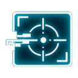
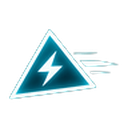
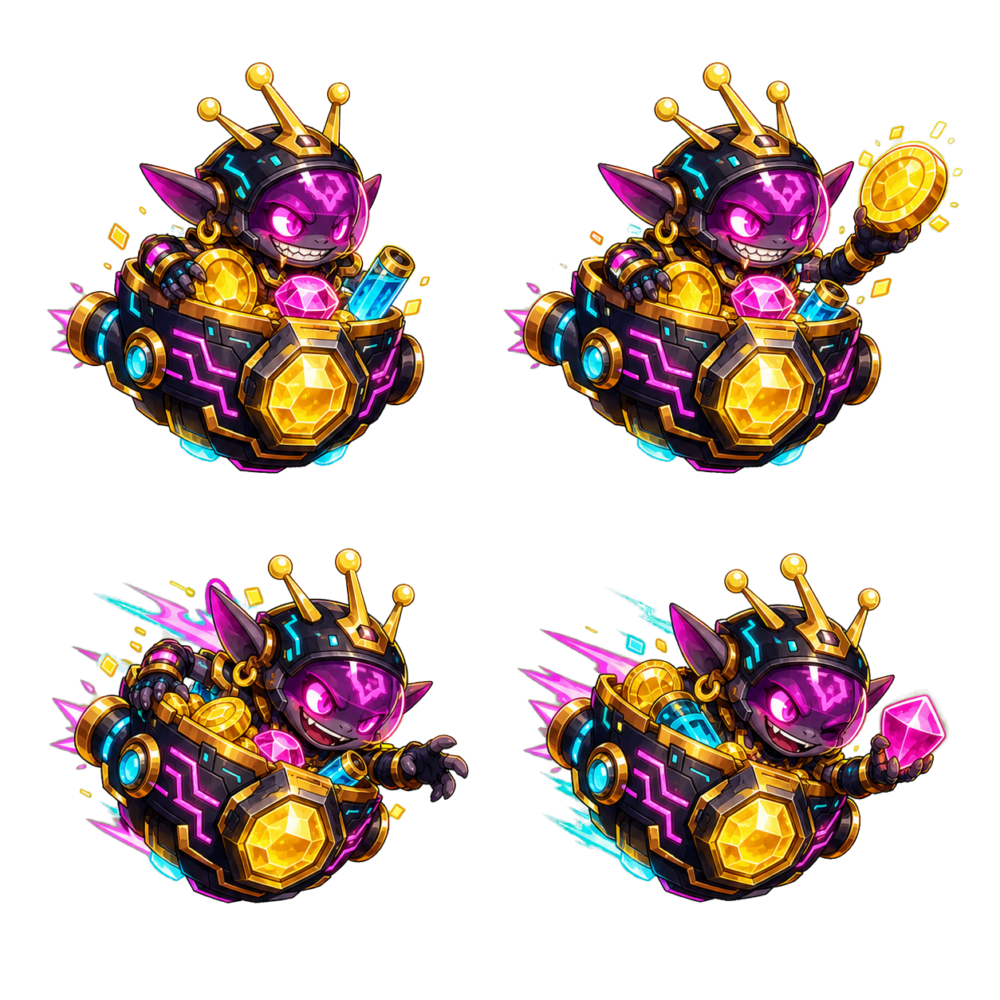
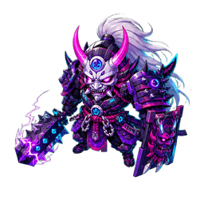
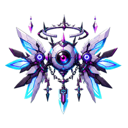
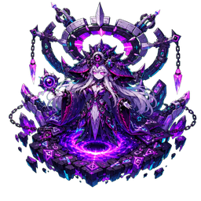
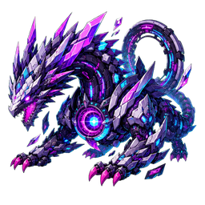
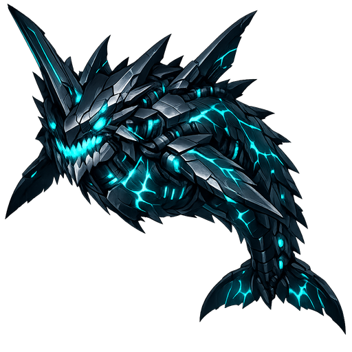

# Neon Arcana: Cyber Rift — 게임 가이드

사이버펑크 도시를 배경으로 한 탑다운 서바이버 로그라이트. 끝없이 몰려드는 적을 뚫고, 술식(빌드)과 유물을 조합해 최대한 오래 생존하는 것이 목표다. 이 문서는 (100% 혼자 기획한 게 아니어도) 현재 게임에 뭐가 들어있는지 한눈에 파악할 수 있도록 정리한 위키형 가이드다.

## 목차

- [조작법](#조작법)
- [게임 진행 흐름](#게임-진행-흐름)
- [3대 공격 빌드](#3대-공격-빌드)
- [전직 (레벨 30)](#전직-레벨-30)
- [몬스터 도감](#몬스터-도감)
- [보스 도감](#보스-도감)
- [사이버 리바이어던 & 삼켜짐 던전](#사이버-리바이어던--삼켜짐-던전)
- [동료(길들인 보스) 시스템](#동료길들인-보스-시스템)
- [강화 목록 (전체)](#강화-목록-전체)
- [유물 목록 (전체)](#유물-목록-전체)
- [랭킹](#랭킹)
- [진행 팁](#진행-팁)

---

## 조작법

- **이동**: `WASD` / 방향키 (모바일은 화면 드래그 조이스틱)
- **조준**: 마우스를 움직이면 그 방향을 자동 조준, 마우스가 없으면 이동 방향을 조준
- **공격은 전부 자동** — 플레이어는 이동과 조준만 하면 됨
- **☰ 메뉴 버튼**: 일시정지, 사운드 on/off, 히트박스 표시, 언어 변경
- **▤ 도감 버튼**: 술식 / 유물 / 전직 정보를 언제든 확인 가능

## 게임 진행 흐름

1. 적을 처치 → 경험치 젬 획득 → 레벨업 시 술식(강화) 1개 선택
2. 일정 시간마다 **이상 현상 보스**가 출현 (제한 시간 있음, 처치 시 유물 획득 확률)
3. **잭팟 그렘린**(보물 몬스터)이 주기적으로 등장 — 도망 다니는 몹, 잡으면 유물
4. **레벨 30**에 도달하면 5가지 전직 중 하나를 선택 (전직하지 않아도 됨)
5. 필드에 살아있는 일반 몹이 너무 많아지면 (150마리 초과) **사이버 리바이어던**이 페널티성으로 등장할 수 있음
6. 시간이 지날수록 적 밀도·공격력·보스 강함이 계속 상승하는 **엔드리스** 구조 — 죽을 때까지, 혹은 포기할 때까지 진행

---

## 3대 공격 빌드

| 빌드 | 방식 | 강화 개방 조건 |
|---|---|---|
| **성좌탄** (투사체) | 기본 원거리 공격. 다중 발사·관통·치명타·폭발(붕괴 잔향)·연쇄 낙뢰로 강화 | 기본 보유 |
| **광검** (근접) | 플레이어 주변 부채꼴 범위를 베는 근접 공격 | '아스트랄 광검' 강화 최초 선택 시 개방 |
| **위성체** (궤도) | 플레이어를 도는 위성이 적과 충돌해 피해 | '수호 위성' 강화 최초 선택 시 개방 |

각 빌드는 관련 강화를 5레벨까지 올리면 **술식 완성(마스터리)**에 도달해 강력한 주기적 필살기를 얻는다. 완성 후에는 **한계돌파** 강화가 열려 필살기 피해·범위·재사용 대기시간을 무한히 더 올릴 수 있다.

> **참고**: 필살기·특수 타겟팅(가장 체력이 높은 적, 보스 우선 공격 등)은 전부 **현재 화면(카메라) 안에 보이는 적**만 대상으로 한다. 화면 밖 저 멀리 있는 적을 끌어와 때리지 않는다.

---

## 전직 (레벨 30)

레벨 30이 되면 아래 5가지 중 하나를 선택한다. 전직하면 게임 플레이 감각이 확 바뀌도록 설계되어 있다. 별표(★)는 자체 평가 난이도(★★★★★ = 쉽고 편함 ~ ★★☆☆☆ = 손이 많이 감).

<table>
<tr><th>전직</th><th>난이도</th><th>핵심 변화</th><th>필살기</th></tr>
<tr>
<td>🔫 <b>실버불렛</b></td>
<td>★★☆☆☆</td>
<td>성좌탄이 은탄으로 변경. 부채꼴 난사 대신 <b>쉬지 않고 쏟아붓는 연사</b>로 변경 (탄 크기 축소, 공격속도 대폭 증가, 발당 피해 감소)</td>
<td>밀집 지역에 원형 난사</td>
</tr>
<tr>
<td>🥷 <b>쉐도우마스터</b></td>
<td>★★☆☆☆</td>
<td>어둠의 쌍검 사용 (범위는 좁아지지만 피해 증가). 평상시 광검이 전방+후방 두 방향으로 갈라진 이중 참격(양옆은 빈 공간)으로 변경. 주기적으로 그림자에 숨어 투명화 + 이동속도 증가 + 주변에 검은 기(다크 오라) 발산. 보스 대상 최종 데미지 +30%</td>
<td>전후방으로 넓게 퍼지는 거대한 어둠의 검기 (레이저가 아닌 참격 파동)</td>
</tr>
<tr>
<td>🛰 <b>메카닉</b></td>
<td>★★★★☆</td>
<td>위성이 충돌 대신 적을 추적하며 레이저 발사. 화면 안의 보스를 우선 공격</td>
<td>과부하 모드 (5초간 이동속도 증가 + 위성 레이저 범위 확대)</td>
</tr>
<tr>
<td>⚡ <b>토르</b></td>
<td>★★★★☆</td>
<td>연쇄 낙뢰가 투사체·위성·광검 모든 공격에 적용, 레벨 7까지 강화 가능. 번개가 노란색으로 화려해짐</td>
<td><b>토르의 망치</b>: 화면 안에서 체력이 가장 높은 적에게 거대한 번개를 내리쳐 기절·감전. <b>쉴드 무시</b> 피해, 연쇄 낙뢰 피해 +40%, 쉴드 대상 추가 +50%</td>
</tr>
<tr>
<td>⬛ <b>방랑자</b></td>
<td>★★★★★</td>
<td>전직하지 않음. 기존 빌드를 그대로 유지</td>
<td>최대 체력 +5 (그 외 변화 없음)</td>
</tr>
</table>

---

## 몬스터 도감

### 일반 몹

기본 실루엣은 전부 동일한 그림자 몹이며, 색상 글로우와 아이콘으로 종류를 구분한다. 시간이 지날수록 새 종류가 아래 순서로 순차 등장한다 (약 8분에 걸쳐 전부 등장, 초반에 몰리지 않도록 조정됨).

| 순서 | 종류 | 등장 시점 | 아이콘 | 행동 |
|---|---|---|---|---|
| 0 | **스토커** (기본형) | 처음부터 | 없음 | 플레이어를 직선으로 추적 |
| 1 | **거너** (원거리) | 약 45초~ |  | 적정 거리를 유지하며 원거리 사격 |
| 2 | **차저** (돌진) | 약 2분 30초~ |  | 접근 후 예고 → 빠르게 돌진 |
| 3 | **워더** (쉴드) | 약 4분 30초~ |  | 체력의 75%에 해당하는 쉴드 보유 (광검에 특효, 성좌탄에 약함) |
| 4 | **봄버** (자폭) | 약 6분 30초~ | 없음(전용 드론 스프라이트) | 접근 후 자폭, 광역 피해 |
| 5 | **스플리터** (분열) | 약 8분~ | 없음 | 사망 시 약한 새끼 몹 2마리로 분열 |

일부 몹은 **엘리트**로 강화되어 등장하며(시간이 지날수록 확률 상승), 체력·크기·이동속도가 증가한다.

### 잭팟 그렘린 (보물 몬스터)

주기적으로 등장하는 도망 다니는 몹. 플레이어가 가까이 가면 도망치고 멀어지면 다시 다가오는 패턴으로 움직인다. 잡으면 유물을 얻을 확률이 있다. 20초 안에 잡지 못하면 도망쳐 사라진다.

---

## 보스 도감

### 이상 현상 보스 (4종)

일정 시간마다 등장하는 원형 보스. 티어 1~3이 존재하며 각 티어마다 강도가 다르고, 격파 시 티어별 격파 수(cycle)에 비례해 점점 강해진다. 제한 시간 내 처치하지 못하면 보스가 도망치며 페널티(주변에 정예 몹 소환 + 플레이어 피해)를 받는다.

<table>
<tr><th>이미지</th><th>이름</th><th>패턴</th></tr>
<tr>
<td></td>
<td><b>네온 오니</b> (집행자)</td>
<td>돌진 예고 후 빠른 대시 반복, 부채꼴 탄막</td>
</tr>
<tr>
<td></td>
<td><b>세라프 아이</b> (관측자)</td>
<td>적정 거리 유지하며 원형 탄막(radial) + 정밀 사격</td>
</tr>
<tr>
<td></td>
<td><b>균열 마녀</b> (티어 3)</td>
<td>공중폭격(에어스트라이크) 다수 소환 + 원형 탄막</td>
</tr>
<tr>
<td></td>
<td><b>코어 드래곤</b> (티어 3)</td>
<td>부채꼴 탄막 + 원형 탄막 복합</td>
</tr>
</table>

공통으로 랜덤 수정자(스위프트=이동속도 증가 / 아머드=방어력 증가 / 언스테이블=패턴 주기 감소)와 어픽스(오버클록/마인필드/에코/헌터)가 붙어 매 격파마다 조합이 달라진다.

- **시간 경과 시각 강화**: 게임 시간 5분을 넘기면 보스 주변에 점점 더 화려한 오라·펄스 링이 추가되어 시각적으로도 위협적으로 변한다.
- **보스 전용 발사체**: 일반 몹 투사체보다 크고 주황빛이 도는 색으로 구분된다.
- **나선 만개 패턴**: 10분 이후부터 추가로 해금되는 3세대 패턴으로, 후반 전투에 변주를 준다.

---

## 사이버 리바이어던 & 삼켜짐 던전

필드에 살아있는 일반 몹이 **150마리를 넘으면**, 일정 확률로 거대한 사이버 리바이어던이 등장한다. 이건 **개체수 과밀에 대한 페널티성 이벤트**다 — 평소 이상 현상 보스보다 훨씬 강하고 위협적이지만, 그만큼 확실한 보상을 준다.

- 다른 일반 몹과 접촉하면 즉시 처치할 만큼 압도적 (위엄을 보여줌)
- 자주 돌진(대시) 공격을 사용하므로 정면 충돌 주의
- **원거리 공격으로 충분히 격파 가능** — 격파 시 82% 확률로 유물 획득 + 아군화 가능성
- **플레이어가 직접 닿으면 "삼켜짐"** — 리바이어던 뱃속의 특수 구역으로 강제 이동

### 삼켜진 동안

1. **바깥 세계가 완전히 정지** — 진행 중이던 보스 타이머를 포함해 모든 바깥 시간이 멈춘다.
2. **60초** 안에 뱃속에서 가장 위엄있고 날렵한 **숙주**를 찾아 처치해야 한다.
3. 숙주 주변에는 일반 몹들과, 처치 시 유물을 **확정 드롭**하는 특수 몹(쉴드 보유) 한 마리가 있다.
4. 60초 안에 숙주를 처치하지 못하면 소화되어 **게임 오버**.
5. 숙주를 처치하면 뱃속이 붕괴하며 **초록빛 비**(숙주의 피)와 함께 바깥으로 탈출, 정지했던 바깥 시간이 다시 흐른다.
6. 탈출 직후에는 잠시(5초) 리바이어던에게 다시 삼켜지지 않도록 안전거리가 확보된다.

---

## 동료(길들인 보스) 시스템

**조련의 코어** 유물을 장착하면, 보스(이상 현상 보스 · 리바이어던)를 처치할 때 일정 확률로 그 보스가 플레이어의 동료가 되어 따라다닌다 (유물 없이는 발생하지 않음 — 자세한 확률은 [유물 목록](#유물-목록-전체) 참고).

- 동료는 최대 **3마리**까지 유지 가능
- 주변 일반 몹을 스스로 찾아가 공격하며, 없으면 플레이어를 따라다님
- 일반 몹의 공격에 맞으면 피해를 입고, 체력이 다하면 사망 (보스보다는 훨씬 약하게 조정됨)

---

## 강화 목록 (전체)

레벨업 시 3개 중 1개를 선택하는 강화 목록. 술식 개방 강화(광검·위성)는 최초 습득 시 해당 빌드가 열린다.

<b>전체 강화 목록 펼치기</b> (30종)

| 강화 | 효과 (레벨당) | 최대 레벨 |
|---|---|---|
| ◆ 룬 증폭 | 모든 공격 피해 +12% | 10 |
| ⌁ 영창 가속 | 성좌탄 공격 간격 -13% | 7 |
| ≋ 쌍성 궤도 | 동시 발사 성좌탄 +1 | 7 |
| ↠ 위상 관통 | 성좌탄 관통 +1 | 6 |
| ✦ 운명 간섭 | 치명타 확률 +8%, 배율 +0.18 | 6 |
| ✺ 붕괴 잔향 | 성좌탄 명중 시 폭발 반경 +22 (최대 132), 폭발 피해 35% | 6 |
| ϟ 연쇄 낙뢰 | 성좌탄 명중 시 210 반경 낙뢰 대상 +1 (최대 5), 28% 피해 | 5 |
| ◉ 거대 성핵 | 성좌탄 크기 +18%, 피해 +10% | 6 |
| ☄ 수호 위성 | 공격 위성 +1 (위성 빌드 개방) | 7 |
| ⟳ 초고속 공전 | 위성 회전 속도 +24% | 5 |
| ⊚ 거대 위성핵 | 위성 크기 +20%, 피해 +16% | 5 |
| ◎ 이중 공전면 | 공전 반경 +16, 위성 피해 +10% | 4 |
| ✹ 초신성 방전 | 위성 명중 시 방전 확률 +12%p (최대 48%), 42% 피해 | 4 |
| ⬡ 성환 요격막 | 위성이 적 투사체를 6% 확률로 소거 | 5 |
| ◌ 맥동 성환 | 위성이 주기적으로 충격파 방출 | 3 |
| ╱ 아스트랄 광검 | 광검 피해 +25% (광검 빌드 개방) | 7 |
| ⌒ 월광 검로 | 광검 사거리 +20, 베기 각도 확대 | 5 |
| ≪ 찰나 발도 | 광검 공격 간격 -17% | 5 |
| 〽 잔상 연격 | 광검 추가 잔상 베기 +1 | 3 |
| ◇ 검막 반사 | 광검 사용 중 방어 확률 +7% | 4 |
| ≫ 공간 도약 | 이동 속도 +11% | 6 |
| ⌾ 중력 우물 | 경험치 흡수 범위 +85 | 6 |
| ♥ 생명 결계 | 최대 체력 +8, 체력 10 회복 | 7 |
| ♧ 재생 술식 | 초당 체력 회복 +0.35 | 6 |
| ⬡ 성좌 방벽 | 피격 무효 확률 +6% | 6 |
| ♢ 마력 정제 | 획득 경험치 +22% | 5 |
| ▣ 차원 수납 확장 | 유물 슬롯 +1 (최대 7, 슬롯이 가득 찼을 때만 등장) | 4 |
| ∞ 각 빌드 한계돌파 | 술식 완성 후 개방. 필살기 피해·범위 증가, 주기 감소 | 무한 |
| ∞ 한계 돌파 (힘/생명/공명) | 레벨 35 이후 등장. 모든 공격 피해 / 체력 / 성장 점진 강화 | 999 |

---

## 유물 목록 (전체)

보스·그렘린 처치 시 확률적으로 획득. 이미 보유한 유물이 다시 나오면 레벨업(효과 중첩, 배율은 레벨만큼 지수적으로 커짐). **유물 슬롯이 가득 차도 새 유물이 나올 수 있으며**, 이 경우 가장 약한(레벨 낮은 · 등급 낮은) 유물이 자동으로 교체된다.

<b>전체 유물 목록 펼치기</b> (20종, 등급별)

**일반**
| 유물 | 효과 (LV.1 기준) |
|---|---|
| ◆ 증폭 아크 셀 | 모든 공격 피해 +10% |
| ♥ 혈류 축전지 | 최대 체력 +12, 최초 획득 시 12 회복 |
| ⌾ 자력 프리즘 | 흡수 범위 +30%, 경험치 +10% |
| ✦ 사냥꾼의 렌즈 | 치명타 +8%, 치명 피해 +0.2 |

**유니크**
| 유물 | 효과 (LV.1 기준) |
|---|---|
| ≋ 분열 코어 | 4번째 성좌탄 일제사격마다 투사체 +2 |
| ⟳ 성환 가속기 | 위성 +1, 속도/피해 +30% |
| ╱ 근접 초점 렌즈 | 광검 피해 +45%, 사거리 +18 |
| ♧ 나노 회복 분기기 | 재생 +0.45, 일반 적 20킬마다 체력 3 회복 |

**전설**
| 유물 | 효과 (LV.1 기준) |
|---|---|
| † 처형 프로토콜 | 일반 적 체력 15% 미만 시 즉시 처형 |
| 〽 공명 탄실 | 6번째 일제사격이 70% 피해로 반복 |
| ◉ 중력 후광 | 주변 일반 적 이동 속도 24% 감소 |
| ♠ 영혼 배터리 | 일반 적 12킬마다 체력 2 회복, 모든 피해 +8% |
| ◎ 사건의 지평선 | 위성 +2, 크기 +45%, 피해 +40%, 충격파 부여 |
| ⌁ 제로 엣지 | 광검 피해 +50%, 속도 +33%, 잔상 베기 +1 |
| ♨ 불사조 커널 | 1회 치명상 무시하고 체력 40%로 부활 |
| ♛ 균열 왕관 | 모든 피해 +22%, 경험치 +25% |
| ☢ 연쇄 기폭 코어 | 자폭 적 폭발이 주변 적에게 30% 피해 |
| ⛓ **조련의 코어** | 보스 처치 시 12%p 확률로 아군화 (레벨당 +12%p, 최대 65%) — [동료 시스템](#동료길들인-보스-시스템)의 유일한 발동 조건 |

**신화**
| 유물 | 효과 (LV.1 기준) |
|---|---|
| ✺ 아르카나 특이점 | 모든 피해 +35%, 각 빌드 추가 피해 +15% |
| ∞ 불멸 회로 | 최대 체력 +30, 재생 +1, 일반 적 8킬마다 2 회복 |
| » 신속 연산기관 | 이동 +25%, 성좌탄·광검·위성 속도 대폭 증가 |

> 유물 레벨이 오를수록 배율 효과는 **지수적으로** 커진다 (예: +22%가 5레벨이면 대략 1.22⁵ ≈ +170%). 너무 과도하게 쌓이지 않도록 일정 시간이 지나면 전체 피해 배율에 완만한 보정(디미니싱)이 걸린다.

---

## 랭킹

메인 화면과 게임 종료 화면에서 글로벌 랭킹을 확인할 수 있다. 각 기록에는 플레이어가 선택한 전직 아이콘이 함께 표시되며, "상세" 버튼을 누르면 종료 시점의 강화·유물 구성과 전직을 자세히 볼 수 있다.

## 진행 팁

- 초반에는 한 가지 빌드에 집중해 마스터리(술식 완성)를 최대한 빨리 띄우는 것이 좋음
- 레벨 30 전직은 신중하게 — 이미 투자한 빌드와 시너지가 좋은 전직을 고르면 좋음 (예: 광검 위주로 키웠다면 쉐도우마스터, 위성 위주라면 메카닉)
- 리바이어던이 뜨면 무리해서 맞서기보다, 준비가 안 됐다면 거리를 벌리는 것도 방법 — 다만 원거리 딜로 충분히 격파 가능하니 화력이 된다면 유물 보상을 노려볼 만하다
- 삼켜졌을 때는 60초가 생각보다 빠듯하니 숙주를 최우선으로 추적할 것
- 조련의 코어를 얻었다면 보스를 자주 잡을수록 동료가 늘어날 기회가 많아진다 (최대 3마리)
