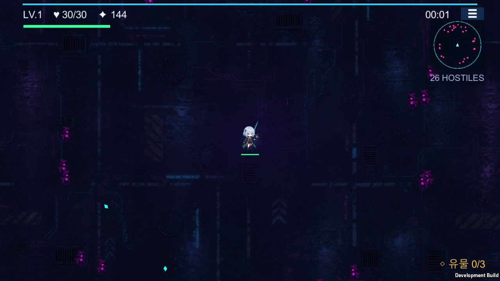
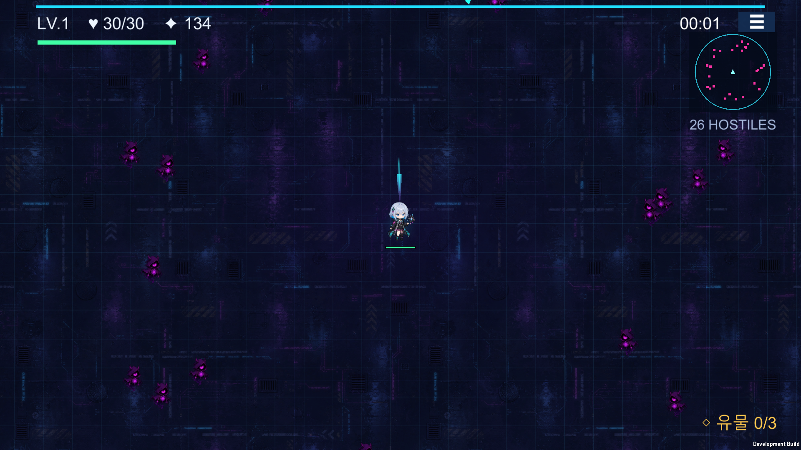

# vinext-starter

> **Neon Arcana: Cyber Rift** lives in this repo. If you're picking this project up —
> especially for the Unity migration — start with [UNITY_MIGRATION_HANDOFF.md](UNITY_MIGRATION_HANDOFF.md),
> not this file. [GAME_GUIDE.md](GAME_GUIDE.md) and [ART_STYLE_GUIDE.md](ART_STYLE_GUIDE.md) are
> the other two docs worth reading. Everything below this line is generic vinext
> starter boilerplate, unrelated to the game itself.

## Unity 마이그레이션 현황

**2026-07-27 사용자 검수 후 3단계 완료 판정을 철회하고 인게임 유사도를 재작업하고 있습니다.**

성좌탄 자동 표적, 단일 이동 패드, 일부 HUD·강화 화면과 핵심 프리팹은 구현됐지만,
도감이 요약 텍스트에 그치고 배경이 플레이어를 따라가 월드 스크롤이 보이지 않는 등
원작 동등성에 중대한 누락이 확인됐습니다.
당분간 전투·월드·HUD·도감·진행·보스·연출 등 인게임만 수정하며,
서버 연결·온라인 랭킹·Release/AAB·스토어·실행 파일 배포는 뒤로 미룹니다.

P0 재작업의 첫 항목으로 Cinemachine 추적 카메라, 5×5 반복 도시 타일,
월드 좌표 그리드를 구현해 맵 스크롤을 복구했습니다. 이어서 도감의 술식·유물·전직
3개 탭과 전체 카드, 작전 메뉴의 정지·음소거·히트박스·포기, 통합 보상 큐와
빌드 결과·재출격·메인 복귀 흐름을 구현했습니다. HUD에는 현재 술식 랭크와
접이식 유물 상세 트레이, 보스 출현 중앙 경고와 미니맵의 노란 보스 표식을 추가했습니다.

- Unity 프로젝트: [`unity/NeonArcanaUnity`](unity/NeonArcanaUnity)
- 1단계 상세 개발 기록: [`docs/UNITY_MIGRATION_PHASE1.md`](docs/UNITY_MIGRATION_PHASE1.md)
- 2단계 상세 개발 기록: [`docs/UNITY_MIGRATION_PHASE2.md`](docs/UNITY_MIGRATION_PHASE2.md)
- 3단계 원작 유사도 복구 기록: [`docs/UNITY_MIGRATION_PHASE3.md`](docs/UNITY_MIGRATION_PHASE3.md)
- 인게임 동등성 재감사·현재 범위: [`docs/UNITY_MIGRATION_INGAME_PARITY_AUDIT_2026-07-27.md`](docs/UNITY_MIGRATION_INGAME_PARITY_AUDIT_2026-07-27.md)
- P0 상세 진행 기록: [`docs/UNITY_MIGRATION_P0_PROGRESS_2026-07-27.md`](docs/UNITY_MIGRATION_P0_PROGRESS_2026-07-27.md)
- 유사도 이탈 회고·재발 방지 기준: [`docs/UNITY_MIGRATION_FIDELITY_RETROSPECTIVE_2026-07-27.md`](docs/UNITY_MIGRATION_FIDELITY_RETROSPECTIVE_2026-07-27.md)
- Android 설치·사용량 특이 사례: [`docs/ANDROID_SETUP_INCIDENT_2026-07-27.md`](docs/ANDROID_SETUP_INCIDENT_2026-07-27.md)
- 제3자 라이브러리: [`docs/THIRD_PARTY_NOTICES.md`](docs/THIRD_PARTY_NOTICES.md)
- 원본 인수인계 문서: [`UNITY_MIGRATION_HANDOFF.md`](UNITY_MIGRATION_HANDOFF.md)






A clean full-stack starter running on
[vinext](https://github.com/cloudflare/vinext), with optional Cloudflare D1 and
Drizzle support.

## Prerequisites

- Node.js `>=22.13.0`

## Quick Start

```bash
npm install
npm run dev
npm run build
```

This starter does not use `wrangler.jsonc`.

## Included Shape

- edit site code under `app/`
- `.openai/hosting.json` declares optional Sites D1 and R2 bindings
- `vite.config.ts` simulates declared bindings for local development
- `db/schema.ts` starts intentionally empty
- `examples/d1/` contains an optional D1 example surface
- `drizzle.config.ts` supports local migration generation when needed

## Workspace Auth Headers

OpenAI workspace sites can read the current user's email from
`oai-authenticated-user-email`.

SIWC-authenticated workspace sites may also receive
`oai-authenticated-user-full-name` when the user's SIWC profile has a non-empty
`name` claim. The full-name value is percent-encoded UTF-8 and is accompanied by
`oai-authenticated-user-full-name-encoding: percent-encoded-utf-8`.

Treat the full name as optional and fall back to email when it is absent:

```tsx
import { headers } from "next/headers";

export default async function Home() {
  const requestHeaders = await headers();
  const email = requestHeaders.get("oai-authenticated-user-email");
  const encodedFullName = requestHeaders.get("oai-authenticated-user-full-name");
  const fullName =
    encodedFullName &&
    requestHeaders.get("oai-authenticated-user-full-name-encoding") ===
      "percent-encoded-utf-8"
      ? decodeURIComponent(encodedFullName)
      : null;

  const displayName = fullName ?? email;
  // ...
}
```

## Optional Dispatch-Owned ChatGPT Sign-In

Import the ready-to-use helpers from `app/chatgpt-auth.ts` when the site needs
optional or required ChatGPT sign-in:

- Use `getChatGPTUser()` for optional signed-in UI.
- Use `requireChatGPTUser(returnTo)` for server-rendered pages that should send
  anonymous visitors through Sign in with ChatGPT.
- Use `chatGPTSignInPath(returnTo)` and `chatGPTSignOutPath(returnTo)` for
  browser links or actions.
- Pass a same-origin relative `returnTo` path for the destination after sign-in
  or sign-out. The helper validates and safely encodes it.
- Mark protected pages with `export const dynamic = "force-dynamic"` because
  they depend on per-request identity headers.

Dispatch owns `/signin-with-chatgpt`, `/signout-with-chatgpt`, `/callback`, the
OAuth cookies, and identity header injection. Do not implement app routes for
those reserved paths. Routes that do not import and call the helper remain
anonymous-compatible.

SIWC establishes identity only; it does not prove workspace membership. Use the
Sites hosting platform's access policy controls for workspace-wide restrictions,
or enforce explicit server-side membership or allowlist checks.

Use SIWC for account pages, user-specific dashboards, saved records, and write
actions tied to the current ChatGPT user. Leave public content anonymous.

## Useful Commands

- `npm run dev`: start local development
- `npm run build`: verify the vinext build output
- `npm test`: build the starter and verify its rendered loading skeleton
- `npm run db:generate`: generate Drizzle migrations after schema changes

## Learn More

- [vinext Documentation](https://github.com/cloudflare/vinext)
- [Drizzle D1 Guide](https://orm.drizzle.team/docs/get-started/d1-new)
