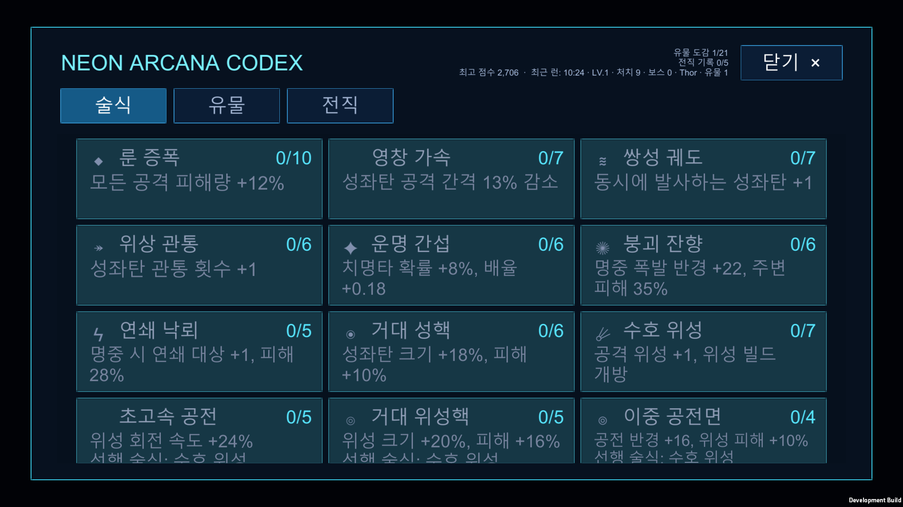
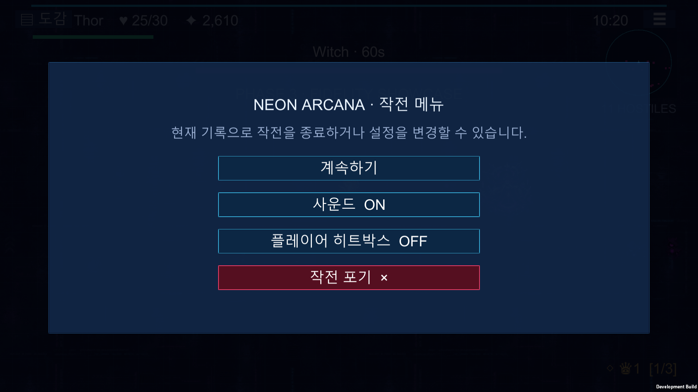
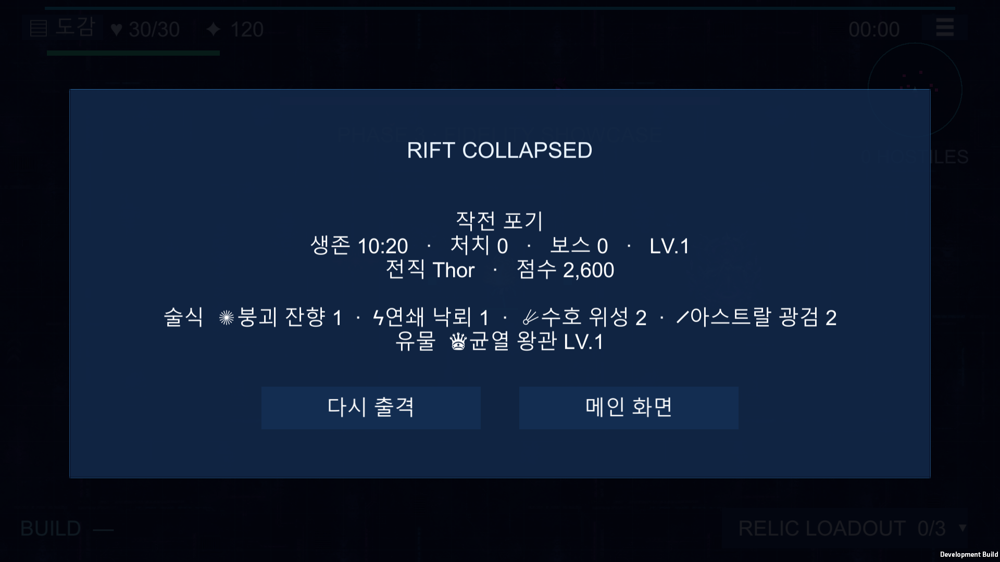
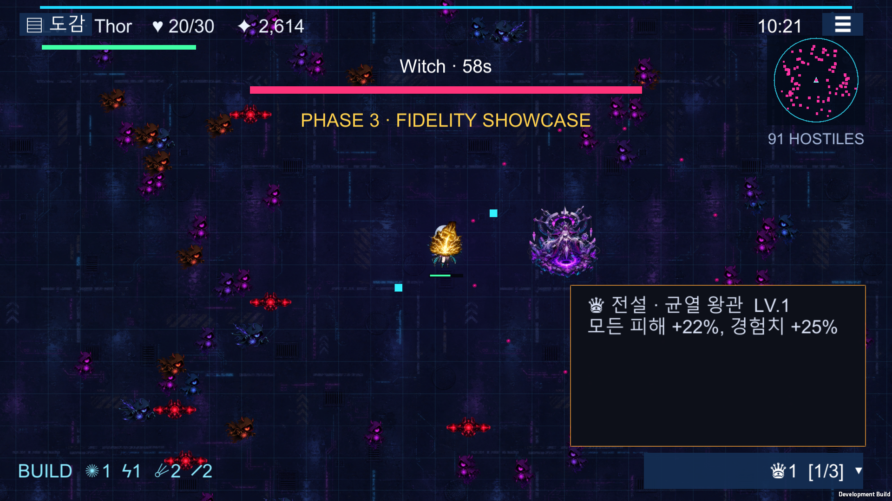
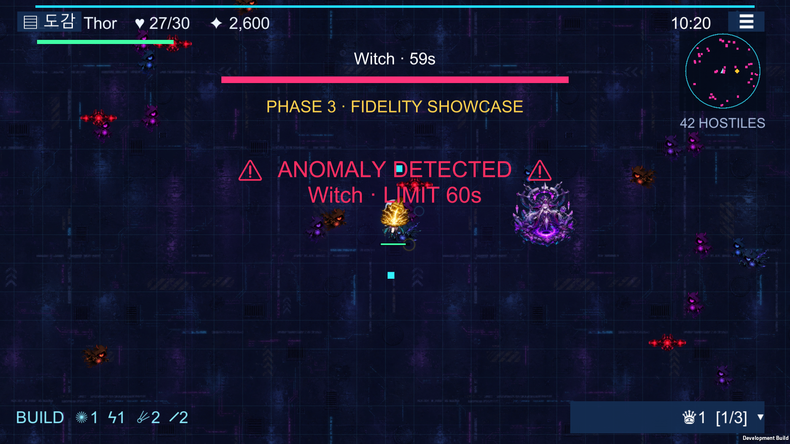

# Unity 인게임 동등성 P0 진행 기록

> 기준일: 2026-07-27
>
> 상태: **P0 진행 중 — 월드·도감·메뉴·보상 흐름·HUD 핵심 정보 구현·기술 검증 통과**
>
> 완료 의미: 아래 항목의 기술 검증만 통과했다. P0 전체 또는 3단계 전체 완료를 뜻하지 않는다.

## 1. 이번 작업 범위

인게임 동등성 재감사에서 P0로 분류한 항목 중 다음 세 묶음을 처리했다.

1. 무한 월드 스크롤과 Cinemachine 추적 카메라
2. 웹판 구조를 기준으로 한 도감 3개 탭과 전체 카드
3. 작전 메뉴, 일시 정지, 음소거, 히트박스 표시, 작전 포기

서버 연결, 온라인 랭킹, Release 배포, Android 반복 테스트는 사용자 지시에 따라
이번 범위에 포함하지 않았다.

## 2. 도감 재구현

### 2.1 이전 상태

이전 Unity 도감은 다음 요약만 출력했다.

```text
유물 도감 n/21
전직 기록 n/5
최고 점수
최근 런
```

웹판에 있는 탭, 전체 카드, 현재 랭크, 희귀도, 유물 레벨, 전직 상태를 확인할 수 없었다.
따라서 카탈로그 데이터가 존재하더라도 사용자가 실제 게임에서 이를 열람할 방법이 없었다.

### 2.2 현재 구조

`CodexView`를 별도 UI 컴포넌트로 만들고 `CodexCard.prefab`을 추가했다.
도감은 다음 데이터를 `ContentDatabase.Catalog`에서 직접 읽는다.

| 탭 | 표시 수 | 상태 정보 |
|---|---:|---|
| 술식 | 27 | 현재 랭크, 최대 랭크, 잠금, 선행 술식, 마스터 상태 |
| 유물 | 21 | 희귀도, 영구 발견 여부, 현재 런 보유 여부, 현재 레벨 |
| 전직 | 5 | 난이도, 설명, 과거 선택 기록, 현재 활성 전직 |

술식 34개 중 `limit_`로 시작하는 반복 한계돌파 7개는 웹판 도감과 같이 기본 술식
목록에서 제외했다. 한계돌파 전용 표시와 실제 마스터리 동작은 P1 비교 대상이다.

카드는 3열 `ScrollRect` 그리드이며 화면 크기에 관계없이 세로 스크롤된다.
도감이 열리면 현재 전투를 정지하고, 닫을 때 보상 선택이나 게임 종료 상태가 아니라면
전투를 재개한다.

### 2.3 프리팹

기존 9개 프리팹에 `CodexCard.prefab`을 추가해 필수 프리팹은 10개가 됐다.
도감 카드의 배경, 외곽선, 아이콘, 이름, 상태, 설명 레이아웃을 프리팹에 직렬화한다.
런타임 코드는 데이터에 따라 프리팹 인스턴스를 채운다.

### 2.4 화면



현재 캡처는 술식 탭의 첫 화면이다. 스크롤 아래에 나머지 카드가 이어진다.
유물과 전직 탭의 카드 수는 Play Mode 검사에서 별도로 검증한다.

## 3. 작전 메뉴

### 3.1 원작 기준

웹판 메뉴에서 인게임에 직접 영향을 주는 항목은 다음과 같다.

- 계속하기
- 사운드 ON/OFF
- 플레이어 히트박스 ON/OFF
- 작전 포기

다국어 선택은 현재 인게임 핵심 재작업 뒤로 미룬 항목이므로 이번 메뉴에는 넣지 않았다.

### 3.2 구현

- HUD 오른쪽 상단 `☰` 버튼
- `Escape`로 열기/닫기
- 메뉴가 열리면 `Time.timeScale = 0`
- 계속하기로 기존 전투 재개
- `M` 또는 메뉴 버튼으로 `AudioListener.volume` 음소거
- 음소거와 히트박스 상태를 `PlayerPrefs`에 저장
- 플레이어 실제 중심에 디버그 링 표시
- 작전 포기 시 현재 기록을 저장하고 게임 종료 결과 화면으로 이동
- 도감, 보상 선택, 게임 종료와 메뉴가 겹쳐 열리지 않도록 진입 조건 분리

기존 오른쪽 상단 `☰`는 실제로는 도감을 열고 있었다.
이를 웹판과 같은 메뉴 버튼으로 되돌리고, 도감은 왼쪽 상단 `▤ 도감` 버튼으로 분리했다.

### 3.3 화면



## 4. UI 모션 안정성

도감과 메뉴는 기존 DOTween 기반 `UiMotion`을 사용한다.
도감 자동 캡처 중 트윈 초기 프레임과 캡처 타이밍이 겹치면 페이드 알파가 남을 가능성을
확인했다. `UiMotion.CompleteImmediately()`를 추가하고 도감 표시 후 0.45초가 지나면
최종 알파와 스케일을 확정하도록 안전장치를 넣었다.

도감의 불투명 배경도 루트 Graphic에서 첫 번째 자식 `Backdrop`으로 분리했다.
레이아웃 루트와 실제 그리기 요소를 나눠 동적 sibling 변경 시 렌더 순서가 흔들리지 않게 했다.

최종 캡처 시 진단 값은 다음과 같다.

```text
active=True
alpha=1.00
scale=1.00
cards=27
firstCardActive=True
firstCardDepth=32
```

## 5. 자동 검증

### 5.1 정적·카탈로그 검증

```text
NEON_ARCANA_VALIDATION_OK
NEON_ARCANA_PHASE2_SIMULATION_OK bosses=13 enemyPeak=190
NEON_ARCANA_PHASE3_VALIDATION_OK ... prefabs=10 ... codex=threeTabs
```

검사 내용:

- `CodexCard.prefab`과 `CodexView` 존재
- Missing Script 없음
- 도감 포함 필수 프리팹 10개
- 기존 오른쪽 공격 패드 재발 없음
- 자동 표적 성좌탄 계약 유지
- 무한 월드 배경과 Cinemachine 구성 유지

### 5.2 Play Mode 스모크

```text
NEON_ARCANA_PHASE3_PLAY_SMOKE_OK
prefabs=10
touchPads=1
targeting=NearestEnemyAutomatic
worldTiles=25
codexTabs=27/21/5
gameMenu=pauseResume
```

Play Mode에서 다음을 실제 실행한다.

- 27개 술식 카드 생성
- 유물 탭으로 전환 후 21개 카드 생성
- 전직 탭으로 전환 후 5개 카드 생성
- 메뉴를 열었을 때 시간 정지
- 메뉴를 닫았을 때 전투 재개
- 플레이어를 `(18, 9)`로 옮긴 뒤 카메라와 무한 월드 앵커 이동
- 자동 성좌탄, 전직, 유물, 보스, 단일 이동 패드 회귀 검사

### 5.3 Windows 빌드

```text
NEON_ARCANA_WINDOWS_BUILD_OK size=167312379
```

Windows 개발 빌드에서 도감과 메뉴 화면을 각각 자동 캡처했다.

## 6. 통합 보상 큐와 종료 흐름

### 6.1 발견한 상태 충돌

기존 Unity는 레벨업, 전직, 유물 보상이 각각 바로 자기 패널을 열었다.
보스 처치에서 `AddExperience()`가 레벨업 화면을 연 직후 `OpenRelicChoice()`가 다시
유물 패널을 열 수 있었다. 한 번에 여러 레벨이 오를 때도 첫 보상 뒤에 `break`해
추가 선택이 유실될 수 있었다.

이를 웹판의 `rewardQueue`와 같은 FIFO 구조로 교체했다.

```text
보상 발생 → Queue에 추가 → 활성 보상이 없을 때 하나만 표시
→ 선택/교체/분해 완료 → 다음 보상 표시 → Queue가 비면 전투 재개
```

지원 보상 유형:

- `Upgrade`: 레벨업 술식 선택
- `Class`: 레벨 30 전직 선택
- `Relic`: 보스·보물 유물 선택

보상 중에는 `activeReward` 하나만 존재하고 선택 패널도 하나만 활성화된다.
유물 슬롯이 가득 찬 경우에는 후보 선택에서 끝내지 않고 교체 또는 분해가 완료돼야
다음 보상으로 이동한다. 선택 가능한 술식이 하나도 없으면 해당 보상은 자동으로 넘긴다.

스모크 검사는 강제로 `Upgrade → Relic → Class`를 넣고 다음 상태를 확인한다.

```text
active=Upgrade
pending=2
activeChoicePanels=1
timeScale=0
```

### 6.2 작전 종료와 메인 복귀

결과 화면에 다음을 추가했다.

- 작전 포기와 일반 사망 결과 구분
- 생존 시간, 처치, 보스, 레벨, 전직, 점수
- 획득 술식 최대 6개와 랭크
- 획득 유물과 레벨
- `다시 출격`: 즉시 새 런으로 초기화
- `메인 화면`: 런을 초기화하고 타이틀 대기 상태로 복귀



자동 검사는 작전 포기, 결과 패널, 시간 정지, 메인 복귀, 타이틀 표시,
런 상태 초기화까지 이어서 실행한다.

```text
NEON_ARCANA_P0_FLOW_OK rewards=queued abandon=result return=title
```

## 7. HUD 빌드·유물 트레이와 선택 입력

웹판 하단의 `build`와 `relic-tray`를 기준으로 다음을 추가했다.

- 현재 획득한 술식 아이콘과 랭크를 왼쪽 하단에 항상 표시
- 오른쪽 하단 `RELIC LOADOUT` 버튼과 장착 수/슬롯 수
- 유물 트레이를 누르면 희귀도, 이름, 레벨, 현재 효과를 펼쳐 표시
- 유물이 없을 때 획득 방법 안내
- 도감·메뉴·보상 선택을 열면 유물 상세가 자동으로 닫혀 패널 중첩 방지



쇼케이스 준비 코드도 실제 효과만 적용하던 방식에서 술식 랭크를 함께 기록하도록 고쳤다.
따라서 HUD, 도감, 결과 화면이 같은 런 상태를 표시한다.

강화·유물·전직 선택에는 숫자열과 숫자 패드의 `1`~`5` 키를 연결했다.
화면 버튼의 기존 리스너를 그대로 호출하므로 마우스·터치와 키보드가 같은 선택 경로를 사용한다.

Play Mode 스모크는 다음을 확인한다.

```text
hud=build+relicDetails
Build Tray에 BUILD 표시
유물 상세에 균열 왕관 표시
```

## 8. 보스 출현 경고와 미니맵 보스 표식

웹판의 전투 흐름처럼 보스가 출현하는 순간을 놓치지 않도록 HUD 중앙 경고를 추가했다.

- 보스 생성 시 화면 중앙에 `ANOMALY DETECTED` 경고 표시
- 보스 종류와 제한 시간을 경고에 함께 표시
- 경고는 2.2초 후 자동으로 닫히며, 기존 보스 체력 바와 남은 시간은 계속 표시
- 미니맵에서 일반 적의 분홍색 점과 구분되는 노란색 다이아몬드로 활성 보스 표시
- 보스가 사라지면 미니맵 표식도 함께 제거



Play Mode 스모크는 실제 보스를 생성한 뒤 중앙 경고가 한 번 이상 표시됐는지,
그리고 미니맵이 활성 보스 위치를 보유하는지 검사한다.

```text
NEON_ARCANA_PHASE3_PLAY_SMOKE_OK ... hud=build+relicDetails+bossWarning
bossWarningWasShown=True
hasBossMinimapMarker=True
```

현재 미니맵에는 플레이어·일반 적·보스까지 표시된다. 보물 상자, 사이버 리바이어던,
내부 던전 입구처럼 아직 게임플레이 자체가 이식되지 않은 특수 대상은 해당 콘텐츠와 함께
추가해야 하므로 이 항목 전체를 완료로 판정하지 않는다. 보스별 공격 예고도 P1 전투 패턴
대조에서 별도로 검증한다.

## 9. 남은 P0

- 미니맵의 보물·리바이어던·내부 던전 등 특수 대상 정보
- 강화 가중치, 선행 조건, 설명과 실제 효과의 원작 대조
- 유물 획득 출처, 중첩, 교체 미리보기, 분해 결과 흐름 대조
- 키보드·마우스·터치 입력의 최종 동등성

위 항목이 끝나기 전에는 P0 완료 또는 3단계 완료로 표시하지 않는다.
