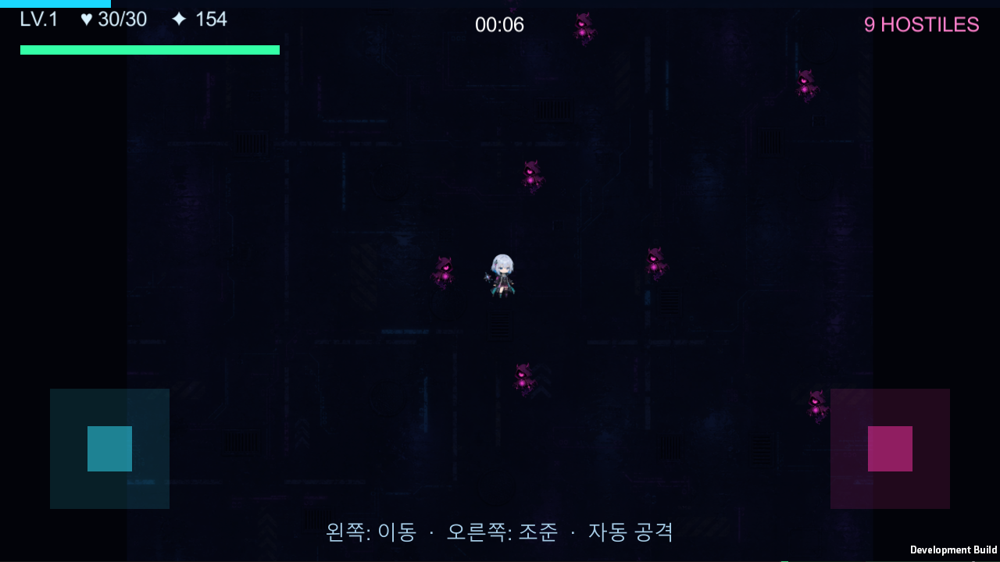
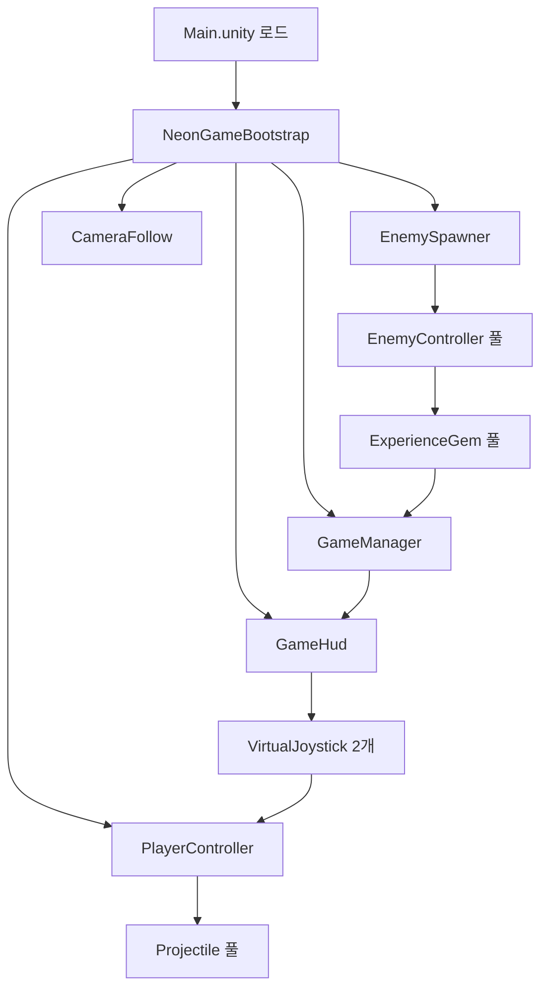

# Unity 마이그레이션 1단계 — 코어 프로토타입 개발 기록

> 작성일: 2026-07-27  
> 상태: **완료**  
> Unity 버전: `6000.5.1f1`  
> 프로젝트 경로: [`unity/NeonArcanaUnity`](../unity/NeonArcanaUnity)

## 1. 문서 목적

이 문서는 Canvas 2D와 JavaScript로 구현된 **Neon Arcana: Cyber Rift**를 Unity로 옮기는 3단계 계획 중, 1단계인 코어 프로토타입을 어떻게 설계하고 구현하고 검증했는지 기록한다.

단순히 완료 목록만 남기는 것이 아니라 다음 작업자가 아래 질문에 답을 얻을 수 있도록 작성했다.

- 웹 버전의 어떤 부분을 Unity에 그대로 가져왔는가?
- 어떤 부분은 Unity 방식으로 새로 설계했는가?
- 현재 코드가 어떤 책임으로 나뉘어 있는가?
- 원본 수치와 공식이 보존되었는가?
- 실제 실행까지 검증했는가?
- 2단계에서 무엇을 이어서 만들어야 하는가?

게임 전체 기획과 수치는 [`UNITY_MIGRATION_HANDOFF.md`](../UNITY_MIGRATION_HANDOFF.md), 플레이어용 전체 콘텐츠 설명은 [`GAME_GUIDE.md`](../GAME_GUIDE.md), 시각 기준은 [`ART_STYLE_GUIDE.md`](../ART_STYLE_GUIDE.md)를 함께 참고한다.

## 2. 3단계 마이그레이션 계획

| 단계 | 목표 | 현재 상태 |
|---|---|---|
| 1단계 — 코어 프로토타입 | 모바일 가로 화면에서 이동·조준·자동 공격·적 스폰·XP·레벨업·HUD가 연결된 한 판을 실행 | **완료** |
| 2단계 — 기능 동등판 | 강화·유물·적·보스·전직 등 웹 버전의 핵심 콘텐츠를 Unity에 이식 | 대기 |
| 3단계 — 출시 품질 | 오디오·세이브·백엔드·실기기 최적화·스토어 준비·장시간 QA | 대기 |

1단계의 핵심 기준은 콘텐츠 양이 아니라 **게임 루프가 Unity에서 실제로 닫히는가**였다.

```text
입력 → 이동·조준 → 자동 공격 → 적 피격·사망
    → 경험치 드롭 → 레벨업 → 강화 선택 → 다음 전투
    → 피격·사망 → 결과 확인 → 재시작
```

## 3. 완료 화면

아래 이미지는 Unity Windows 개발 빌드를 `1280×720` 창 모드로 직접 실행해 캡처한 화면이다. 문서용 목업이 아니라 이 저장소의 Unity 프로젝트에서 생성된 실제 런타임 화면이다.



화면에서 확인할 수 있는 요소:

- 원본 Astra 캐릭터와 Shade 적 스프라이트
- 원본 사이버 도시 배경
- HP, 레벨, 점수, 타이머, 현재 적 수
- 화면 상단 HP·XP 진행 막대
- 왼쪽 이동 스틱과 오른쪽 조준 스틱
- 모바일 조작 안내
- 다수의 적이 플레이어를 추적하는 전투 상태

## 4. 개발 환경 확인

개발 PC에서 다음 Unity 설치 상태를 확인했다.

| 항목 | 확인 결과 |
|---|---|
| Unity 에디터 | `6000.5.1f1` 실행 가능 |
| Windows Standalone Support | 설치됨 |
| WebGL Support | 설치됨 |
| Android Build Support | **Unity 6.5.1에는 미설치** |
| Android SDK/NDK·OpenJDK | **Unity 6.5.1에는 미설치** |

따라서 1단계는 Unity 에디터 Play Mode와 Windows 개발 빌드로 검증했다. 모바일 입력 UI와 가로 화면 설정은 구현했지만 APK 생성과 실제 Android 터치 검증은 Android 모듈 설치 후 진행해야 한다.

## 5. 저장소 구조

Unity 프로젝트는 기존 웹 프로젝트와 충돌하지 않도록 별도 디렉터리에 배치했다.

```text
unity/NeonArcanaUnity/
├─ Assets/
│  ├─ NeonArcana/
│  │  ├─ Combat/          투사체와 공격 런타임
│  │  ├─ Core/            부트스트랩, 게임 상태, 공식, 에셋 로딩
│  │  ├─ Editor/          프로젝트 설정·검증·빌드 자동화
│  │  ├─ Enemies/         적 런타임과 스포너
│  │  ├─ Input/           모바일 가상 조이스틱
│  │  ├─ Player/          이동·조준·공격·체력
│  │  ├─ Progression/     경험치 보석
│  │  └─ UI/              HUD·레벨업·게임 오버
│  ├─ Resources/Art/      1단계에서 사용하는 원본 PNG
│  └─ Scenes/Main.unity   실행 및 빌드 진입 씬
├─ Packages/
├─ ProjectSettings/
├─ README.md
└─ PROJECT_STATUS.md
```

Unity가 생성하는 `Library`, `Temp`, `Logs`, `UserSettings`, `Builds`는 커밋하지 않는다. 프로젝트를 내려받아 열면 Unity가 다시 생성할 수 있는 캐시이거나 플랫폼별 산출물이기 때문이다.

## 6. 런타임 아키텍처

### 6.1 전체 흐름



### 6.2 코드 생성형 부트스트랩을 선택한 이유

1단계에서는 씬에 다수의 프리팹과 직렬화 참조를 수동으로 배치하는 대신, `NeonGameBootstrap`이 필요한 런타임 오브젝트를 생성한다.

장점:

- 빈 `Main` 씬에서도 재현 가능하다.
- 에셋 참조 누락 때문에 씬이 깨질 가능성이 낮다.
- 배치 모드에서 자동 검증하기 쉽다.
- 1단계 구조 변경 속도가 빠르다.

한계:

- 아티스트가 에디터에서 UI와 프리팹을 직접 조정하기에는 불편하다.
- 콘텐츠가 늘어나면 코드에 하드코딩된 생성 로직이 커진다.

따라서 2단계에서는 안정화된 오브젝트를 프리팹과 ScriptableObject 데이터로 점진적으로 옮기는 것이 적절하다. 1단계 부트스트랩은 자동화 테스트와 최소 실행 환경으로 계속 유지할 수 있다.

## 7. 구현 상세

### 7.1 게임 상태와 원본 공식

[`GameBalance.cs`](../unity/NeonArcanaUnity/Assets/NeonArcana/Core/GameBalance.cs)에 웹 버전의 시작 수치와 핵심 공식을 모았다.

보존한 시작 값:

```text
HP              30
기본 피해       2.4
공격 주기       0.54초
치명타 확률     7%
치명타 배율     1.75
동시 발사       1
```

웹 버전의 픽셀 단위 이동속도 `250`은 Unity 월드 좌표에서 직접 사용할 수 없으므로, 화면 크기와 카메라 높이에 맞춰 `5 units/sec`로 정규화했다. 이는 수치의 의미를 바꾼 것이 아니라 렌더링 좌표계 차이를 보정한 것이다.

레벨업 필요 경험치:

```csharp
floor(7 + 1.55 × level + 0.17 × level² + 0.5)
```

점수:

```text
킬×10 + 레벨×120 + 생존초×4 + 보스×1000 + 첫 클리어×2500
```

난이도:

```text
(1 + time/170 + (time/420)^1.35) × lateGame
```

### 7.2 JavaScript와 Unity 반올림 차이

초기 검증에서 중요한 언어 차이를 발견했다.

- JavaScript `Math.round(206.5)` → `207`
- Unity `Mathf.RoundToInt(206.5f)` → 짝수 쪽인 `206`

Unity의 `Mathf.RoundToInt`는 midpoint에서 banker's rounding을 사용하기 때문에 원본 공식을 그대로 옮기면 특정 레벨에서 경험치가 1씩 달라질 수 있다.

이를 방지하기 위해 다음 방식으로 구현했다.

```csharp
Mathf.FloorToInt(value + 0.5f)
```

검증 항목에는 레벨 1과 레벨 30의 기대값을 포함시켜 이후 리팩터링에서도 이 차이가 다시 들어오지 않게 했다.

### 7.3 플레이어 입력

[`PlayerController.cs`](../unity/NeonArcanaUnity/Assets/NeonArcana/Player/PlayerController.cs)와 [`VirtualJoystick.cs`](../unity/NeonArcanaUnity/Assets/NeonArcana/Input/VirtualJoystick.cs)가 입력을 담당한다.

모바일:

- 왼쪽 스틱: 이동 벡터
- 오른쪽 스틱: 조준 벡터
- 공격은 자동

에디터·Windows:

- `WASD` 또는 방향키: 이동
- 마우스를 움직이면 마우스 월드 좌표 방향으로 조준
- 마우스 입력이 없으면 가장 가까운 적을 자동 조준

마우스를 한 번도 움직이지 않은 헤드리스 테스트 환경에서도 전투가 진행되도록, 가장 가까운 적 보조 조준을 별도 경로로 유지했다.

### 7.4 자동 공격과 투사체

[`Projectile.cs`](../unity/NeonArcanaUnity/Assets/NeonArcana/Combat/Projectile.cs)는 다음을 구현한다.

- 플레이어 공격 주기에 따른 자동 발사
- 멀티샷 수에 따른 부채꼴 분산
- 치명타 확률과 배율
- 투사체 이동과 수명
- 적 반경 판정
- 피격 후 풀 반환
- 시안색 트레일과 치명타 색 구분

1단계에서는 Rigidbody2D와 Collider2D를 모든 탄에 붙이지 않았다. 후반에 수백 개의 적과 투사체가 존재하는 게임이므로, 단순 거리 판정과 풀링이 모바일에서 예측 가능한 비용을 갖기 때문이다.

### 7.5 적과 스폰

[`EnemyController.cs`](../unity/NeonArcanaUnity/Assets/NeonArcana/Enemies/EnemyController.cs)는 기본 추적형 적 하나를 구현한다.

- 플레이어 방향으로 이동
- 시간에 따른 속도·체력·공격력 증가
- 플레이어 접촉 피해와 재피격 간격
- 투사체 피해와 치명타 피드백
- 사망 시 경험치 보석 생성
- 적 인스턴스 재사용

`EnemySpawner`는 카메라 바깥 원주에서 적을 생성한다. 초반 60초는 원본의 opening scale 개념처럼 목표 밀도를 `0.7 → 1.0`으로 보간한다.

1단계 적 상한은 빠른 검증을 위해 `120`으로 두었다. 원본 전체 콘텐츠의 최종 상한 `210`은 2단계에서 공간 분할과 모바일 프로파일링을 적용한 뒤 복원한다.

### 7.6 경험치와 레벨업

[`ExperienceGem.cs`](../unity/NeonArcanaUnity/Assets/NeonArcana/Progression/ExperienceGem.cs)는 적 사망 위치에 경험치 보석을 만들고 다음 과정을 처리한다.

1. 플레이어가 자석 범위에 들어온다.
2. 거리에 따라 보석의 흡수 속도가 증가한다.
3. 플레이어 반경 안에 도달하면 경험치를 지급한다.
4. 보석을 비활성화하고 풀에 반환한다.

레벨업 시:

- `Time.timeScale = 0`으로 전투를 멈춘다.
- 중복되지 않는 강화 3종을 가중치로 뽑는다.
- 선택한 강화의 랭크와 효과를 적용한다.
- 패널을 닫고 전투를 재개한다.

현재 들어 있는 시작 강화:

| 강화 | 효과 | 최대 랭크 |
|---|---|---:|
| 룬 증폭 | 투사체 피해 ×1.12 | 10 |
| 영창 가속 | 공격 간격 ×0.87 | 7 |
| 쌍성 궤도 | 동시 발사 +1 | 7 |
| 공간 도약 | 이동속도 ×1.11 | 6 |
| 생명 결계 | 최대체력 +8, 체력 10 회복 | 7 |
| 중력 우물 | 경험치 흡수 범위 +0.8 Unity units | 6 |

재시작 시 플레이어 스탯뿐 아니라 강화 랭크도 초기화한다.

### 7.7 HUD와 게임 흐름

[`GameHud.cs`](../unity/NeonArcanaUnity/Assets/NeonArcana/UI/GameHud.cs)는 코드에서 Canvas와 컨트롤을 생성한다.

HUD:

- 레벨
- 현재·최대 HP
- 점수
- 생존 시간
- 현재 적 수
- HP 막대
- XP 막대
- 모바일 조이스틱

상태 패널:

- 레벨업 강화 3장
- 게임 오버 결과
- 다시 시작 버튼
- 피격 시 붉은 화면 플래시

게임 오버에서는 시간을 멈추고 결과를 표시한다. 재시작은 적·투사체·경험치 보석 풀의 활성 오브젝트를 정리하고 게임 상태와 플레이어 빌드를 초기화한다.

## 8. 오브젝트 풀링 전략

| 대상 | 생성 조건 | 반환 조건 |
|---|---|---|
| 투사체 | 자동 공격 | 적 명중 또는 수명 종료 |
| 적 | 스포너 요청 | 체력 0 또는 재시작 |
| 경험치 보석 | 적 사망 | 플레이어 습득 또는 재시작 |

현재 구현은 Unity `Instantiate/Destroy`를 전투 중 반복하지 않는다. 2단계에서 VFX, 적 탄환, 보스 위험지대, 동료 공격을 추가할 때도 같은 수명 주기를 적용한다.

## 9. 에셋 마이그레이션

1단계에서 재사용한 원본:

| 원본 파일 | Unity 경로 | 사용처 |
|---|---|---|
| `public/assets/astra-sd.png` | `Assets/Resources/Art/astra-sd.png` | 플레이어 |
| `public/assets/shade-sd.png` | `Assets/Resources/Art/shade-sd.png` | 기본 적 |
| `public/assets/cyber-city.png` | `Assets/Resources/Art/cyber-city.png` | 배경 |

Astra와 Shade는 `2×2` 프레임 시트다. `NeonAssets.SpriteFrame`이 원본 텍스처에서 필요한 셀을 계산해 Sprite로 만든다.

1단계에서는 정지 프레임 하나만 사용한다. 2단계에서 이동 방향과 속도에 따라 나머지 프레임을 순환하고, 전직 장식이 애니메이션 프레임과 함께 움직이도록 Animator 또는 본 기반 부착 구조를 추가한다.

## 10. 자동 설정과 검증 도구

[`NeonProjectSetup.cs`](../unity/NeonArcanaUnity/Assets/NeonArcana/Editor/NeonProjectSetup.cs)는 다음 에디터 자동화를 제공한다.

| 메서드 | 역할 |
|---|---|
| `Configure` | Main 씬 생성, 빌드 씬 등록, 가로 화면·앱 식별자 설정 |
| `ValidateBatch` | 공식과 씬·빌드 설정 검증 |
| `PlaySmokeBatch` | Play Mode에서 부트스트랩·HUD·스폰·전투·킬 확인 |
| `BuildWindowsBatch` | Windows x64 개발 빌드 생성 |

Unity 메뉴의 `Neon Arcana/Configure Prototype Project`로도 초기 설정을 다시 실행할 수 있다.

## 11. 검증 결과

### 11.1 정적 컴파일과 공식 검증

결과:

```text
NEON_ARCANA_VALIDATION_OK
Unity exit code: 0
```

검증 내용:

- 전체 C# 스크립트 컴파일
- 레벨 1·30 경험치 곡선
- 시작 난이도
- 점수 공식
- `Main.unity` 존재
- Build Settings에 Main 씬이 활성 상태로 등록

### 11.2 Play Mode 스모크 테스트

결과:

```text
NEON_ARCANA_PLAY_SMOKE_OK enemies=5 kills=3 elapsed=4.95
Unity exit code: 0
```

실제 검사:

- `GameManager` 런타임 생성
- 플레이어 생성
- HUD 생성
- 적 스폰
- 자동 조준
- 투사체 발사
- 적 피격과 사망
- 5초 안에 최소 1킬 이상

최종 실행에서는 5마리 활성 상태에서 3킬을 기록했다.

### 11.3 Windows 빌드와 실행

결과:

```text
NEON_ARCANA_WINDOWS_BUILD_OK
Build size: 약 150 MB
```

빌드 후 생성된 실행 파일을 `-batchmode -nographics`로 7초간 실행했다. 게임 런타임 예외 없이 부트스트랩과 플레이어 루프가 시작되는 것을 확인했다.

Windows 빌드 파일은 약 150MB이고 Unity 프로젝트에서 재생성할 수 있으므로 Git 저장소에는 포함하지 않는다.

## 12. 프로젝트 실행 방법

### Unity 에디터

1. 저장소를 clone 또는 pull한다.
2. Unity Hub에서 `unity/NeonArcanaUnity`를 추가한다.
3. Unity `6000.5.1f1`로 프로젝트를 연다.
4. `Assets/Scenes/Main.unity`를 연다.
5. Play를 누른다.

### 조작

| 환경 | 이동 | 조준 | 공격 |
|---|---|---|---|
| Unity 에디터·Windows | WASD/방향키 | 마우스 | 자동 |
| 모바일 | 왼쪽 가상 스틱 | 오른쪽 가상 스틱 | 자동 |

### 검증 명령 예시

PowerShell에서 Unity 설치 경로를 환경에 맞게 바꾼다.

```powershell
$unity = "C:\Program Files\Unity\Hub\Editor\6000.5.1f1\Editor\Unity.exe"
$project = "<repo>\unity\NeonArcanaUnity"

& $unity -batchmode -nographics -quit `
  -projectPath $project `
  -executeMethod NeonArcana.Editor.NeonProjectSetup.ValidateBatch `
  -logFile "unity-validate.log"
```

Windows 빌드:

```powershell
& $unity -batchmode -nographics -quit `
  -projectPath $project `
  -executeMethod NeonArcana.Editor.NeonProjectSetup.BuildWindowsBatch `
  -logFile "unity-build-windows.log"
```

## 13. 알려진 제한과 기술 부채

### 13.1 Android 빌드 모듈

현재 개발 PC의 Unity 6.5.1에 Android 모듈이 없다. Unity Hub에서 다음 항목을 설치해야 한다.

- Android Build Support
- Android SDK & NDK Tools
- OpenJDK

모듈 설치 후 해야 할 검증:

- ARM64 APK 또는 AAB 빌드
- 실제 휴대폰에서 두 손가락 동시 터치
- 화면 노치와 safe area
- 백그라운드 전환과 복귀
- 30·60fps 프레임 페이싱
- 발열과 배터리 사용량

### 13.2 UI와 프리팹

현재 UI는 코드 생성형이다. 2단계에서 화면 구성이 안정되면 프리팹·UI Toolkit 또는 uGUI 프리팹으로 옮겨 디자이너 편집성을 확보한다.

### 13.3 적 탐색

현재 기본 적 수에서는 선형 탐색으로 가장 가까운 적과 투사체 충돌을 찾는다. 원본 상한 210마리와 다중 투사체를 복원하기 전에 공간 해시 또는 균일 그리드를 적용한다.

### 13.4 애니메이션

플레이어와 적은 정지 프레임을 사용한다. 전직 외형 변화 전에 2×2 시트 애니메이션과 방향 전환 규칙을 먼저 확정한다.

### 13.5 오디오

1단계에는 오디오가 없다. 웹 버전의 절차적 Web Audio 구현을 그대로 옮기지 않고, Unity AudioMixer와 파일 기반 SFX/BGM 파이프라인을 3단계에서 구성한다.

## 14. 1단계 완료 기준

- [x] Unity 6 프로젝트 생성
- [x] Main 씬과 Build Settings 구성
- [x] 모바일 가로 화면 설정
- [x] 이동·조준 입력
- [x] 자동 공격
- [x] 적 스폰·추적·접촉 피해
- [x] 적 사망과 경험치 보석
- [x] HP·XP·점수·타이머 HUD
- [x] 레벨업 카드 3장과 강화 적용
- [x] 게임 오버·재시작
- [x] 오브젝트 풀링
- [x] 원본 플레이어·적·배경 에셋
- [x] 공식 단위 검증
- [x] Play Mode 전투 스모크 테스트
- [x] Windows 빌드와 런타임 실행
- [ ] Android APK와 실기기 터치 검증 — Android 모듈 설치 후 진행

Android APK는 현재 PC 환경의 외부 선행조건 때문에 남아 있으나, 사용자가 정의한 1단계 목표인 **Unity에서 코어 게임 루프가 한 판 돌아가는 상태**는 달성했다.

## 15. 2단계 권장 작업 순서

2단계는 아래 순서로 진행하는 것이 안전하다.

1. ScriptableObject 기반 강화·유물 데이터 모델
2. 원본 강화 약 30종 전체 이식
3. 유물 5단계 희귀도와 장착·교체·분해
4. 적 아키타입 6종과 시간 잠금 해제
5. 공간 해시와 모바일 성능 계측
6. 기본 보스 4종
7. 보스 옵션 9종과 제한시간
8. 레벨 30 전직 5종
9. 애니메이션과 전직 외형 변화
10. 도감·결과 상세·세이브 기초

2단계 완료 기준은 단순히 클래스가 존재하는 것이 아니라 다음과 같이 잡아야 한다.

- 웹 버전의 강화·유물·적·보스·전직 핵심 규칙이 플레이 가능하다.
- 시간대별 스폰·희귀도·옵션 분포를 자동 시뮬레이션으로 검증한다.
- 15분 이상 플레이에서 풀 누수와 지속적인 GC spike가 없다.
- 원본과 동일한 점수·경험치·난이도 공식이 유지된다.
- 전직마다 실제 외형과 공격 방식이 바뀐다.

## 16. 인수인계 요약

1단계 결과는 데모용 화면만 만든 것이 아니다. 입력, 전투, 적, 경험치, 레벨업, UI, 게임 오버, 재시작이 연결된 Unity 런타임 기반을 만들고 자동 검증과 실행 빌드까지 확인했다.

2단계에서 가장 중요한 일은 이 기반 위에 콘텐츠를 무작정 추가하는 것이 아니라:

- 데이터를 코드에서 분리하고,
- 적 탐색을 공간 분할로 확장하고,
- 각 확률과 스케일 공식을 자동 검증하며,
- 전직 외형·공격 판정·이펙트가 일치하도록 만드는 것이다.

이 문서와 [`UNITY_MIGRATION_HANDOFF.md`](../UNITY_MIGRATION_HANDOFF.md)를 함께 읽으면 2단계 구현을 바로 이어갈 수 있다.
