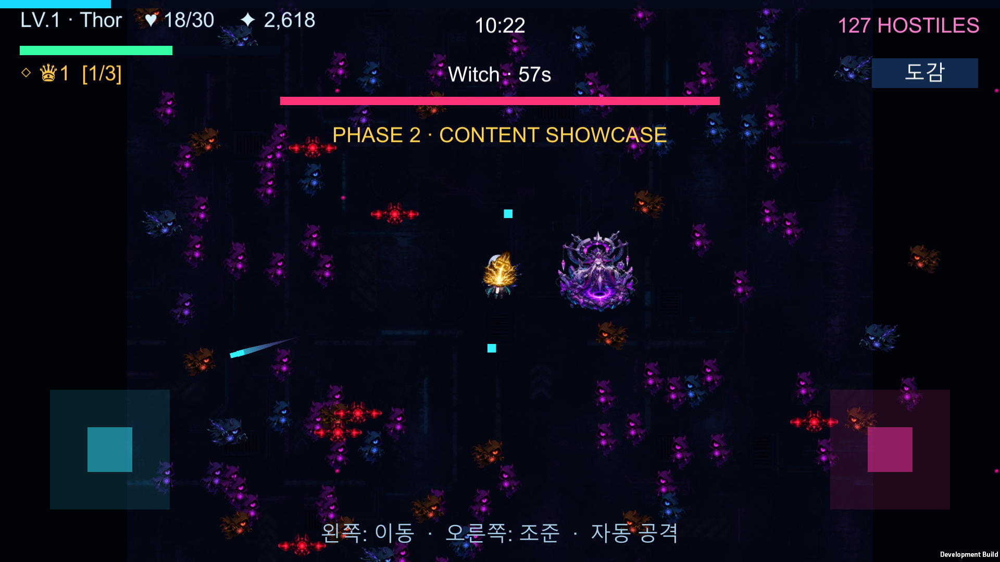
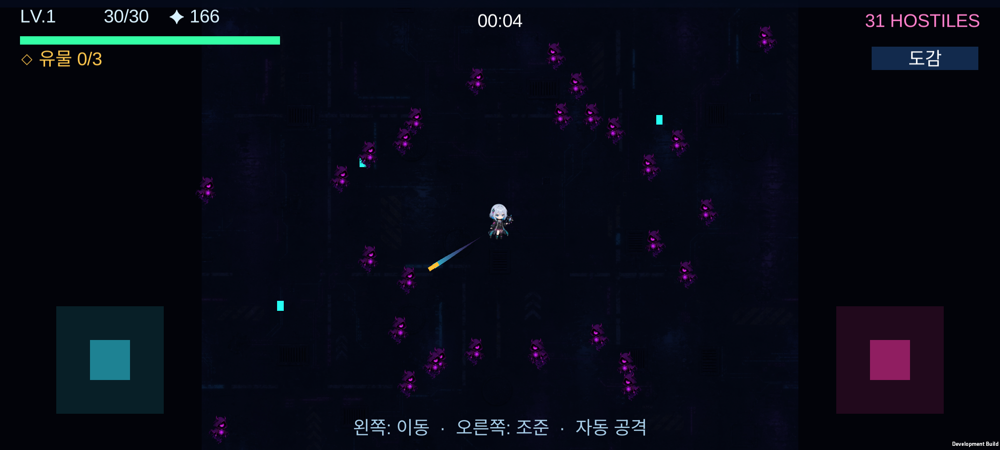

# Unity 마이그레이션 2단계 — 콘텐츠 시스템 확장 개발 기록

> 기준일: 2026-07-27
>
> Unity: `6000.5.1f1`
>
> 프로젝트: [`unity/NeonArcanaUnity`](../unity/NeonArcanaUnity)
>
> 이전 단계: [`UNITY_MIGRATION_PHASE1.md`](UNITY_MIGRATION_PHASE1.md)
>
> Android 설치 특이 사례: [`ANDROID_SETUP_INCIDENT_2026-07-27.md`](ANDROID_SETUP_INCIDENT_2026-07-27.md)
>
> 유사도 이탈 회고: [`UNITY_MIGRATION_FIDELITY_RETROSPECTIVE_2026-07-27.md`](UNITY_MIGRATION_FIDELITY_RETROSPECTIVE_2026-07-27.md)
>
> 후속 복구 결과: [`UNITY_MIGRATION_PHASE3.md`](UNITY_MIGRATION_PHASE3.md)

## 1. 결과 요약

> **상태 정정**
>
> 이 문서의 “2단계 완료”는 콘텐츠 시스템의 기술 구현 완료를 뜻한다.
> 웹판과의 행동·조작·시각 유사도는 승인되지 않았으며 전체 마이그레이션 단계로는 보정이 필요하다.

2단계 콘텐츠 시스템의 기술 구현을 완료했다.

1단계의 이동, 조준, 자동 공격, 경험치, 레벨업, HUD, 오브젝트 풀링 위에 다음 시스템을 추가했다.

- 강화 데이터 34종
- 유물 데이터 21종
- 실제 획득 가능한 유물 20종
- 유물 장착, 중첩, 교체, 분해, 도감
- 적 아키타입 6종
- 보스 4종
- 보스 옵션 9종
- 보스 제한 시간, 성공/실패 처리, 보상
- 레벨 30 전직 5종
- 성좌탄 관통, 폭발, 연쇄
- 아스트랄 광검 빌드
- 수호 위성 빌드
- 클래스별 전투 동작
- 최고 점수, 전직 기록, 마지막 런 요약 저장
- 15분 결정론 콘텐츠 시뮬레이션
- Phase 2 Play Mode 스모크 테스트
- Windows 개발 빌드
- ARM64 IL2CPP Android APK 빌드 및 에뮬레이터 스모크 실행

사이버 리바이어던 내부 던전, 길들인 보스 동료, 온라인 랭킹, 오디오 폴리싱은
기존 계획의 3단계였으나 현재 4단계로 순연됐다.

## 2. 단계 정의

| 단계 | 목표 | 상태 |
|---|---|---|
| 1단계 | 이동·조준·자동 공격·레벨업이 가능한 코어 프로토타입 | 기술 완료 |
| 2단계 | 강화·유물·적 아키타입·보스·전직·저장 시스템 확장 | 기술 완료, 유사도 미승인 |
| 새 3단계 | 원작 조작·화면·프리팹 유사도 복구 | 구현·기술 검증 완료, 사용자 승인 대기 |
| 4단계 | 기존 3단계의 리바이어던·동료·오디오·온라인·모바일 제품화 | 순연 |

2단계 완료의 의미는 “원본의 모든 기능을 완전히 동일하게 이식했다”가 아니다.
핵심 콘텐츠 데이터와 런타임 상호작용을 Unity 구조로 옮기고, 15분 진행에서 주요 시스템이 함께 작동하는 상태를 만들었다는 뜻이다.

## 3. 완료 화면

### Windows Phase 2 쇼케이스



화면에서 다음 요소를 동시에 확인할 수 있다.

- 토르 전직
- 장착 유물
- 균열 마녀 보스와 제한 시간
- 보스 체력 바
- 추적자, 사수, 돌격병, 방벽병, 자폭 드론, 분열체
- 광검과 위성 빌드
- 모바일 듀얼 스틱 UI
- 10분 이후 난이도와 127개 적 개체

### Android 에뮬레이터 스모크



Android 화면은 설치와 렌더링 검증 증거다.
최종 성능 인증이나 실제 모바일 조작 품질의 증거로 사용하지 않는다.

## 4. 주요 파일

```text
Assets/NeonArcana/
├─ Combat/
│  ├─ Projectile.cs
│  └─ CombatPulse.cs
├─ Core/
│  ├─ GameBalance.cs
│  ├─ GameManager.cs
│  ├─ NeonAssets.cs
│  └─ NeonGameBootstrap.cs
├─ Editor/
│  └─ NeonProjectSetup.cs
├─ Enemies/
│  ├─ EnemyController.cs
│  └─ EnemyProjectile.cs
├─ Player/
│  └─ PlayerController.cs
├─ Progression/
│  ├─ ExperienceGem.cs
│  ├─ GameContentCatalog.cs
│  └─ SaveProgress.cs
└─ UI/
   └─ GameHud.cs
```

`GameContentCatalog`은 정적 콘텐츠 정의를 보관하고,
`GameManager`는 런 단위 상태와 선택 흐름을 관리한다.
플레이어와 적 컴포넌트는 실제 전투 효과만 처리한다.

## 5. 데이터 중심 콘텐츠 카탈로그

`GameContentCatalog`은 `ScriptableObject`다.

```text
Assets/Resources/Data/NeonArcanaContent.asset
```

카탈로그에는 다음 목록이 직렬화된다.

| 데이터 | 개수 |
|---|---:|
| 강화 | 34 |
| 유물 | 21 |
| 적 아키타입 | 6 |
| 보스 | 4 |
| 보스 옵션 | 9 |
| 전직 | 5 |

에디터 설정 명령이 에셋을 생성한다.
런타임에서 에셋을 찾지 못하면 `ContentDatabase.CreateDefault()`가 같은 기본 데이터를 만든다.
따라서 에셋 누락이 즉시 빈 콘텐츠로 이어지지 않는다.

### 데이터와 런타임의 분리

- 카탈로그: 이름, 설명, 희귀도, 해금 조건, 배율
- `GameManager`: 선택, 적용, 교체, 저장
- `PlayerController`: 플레이어 스탯과 무기 동작
- `EnemyController`: 적 행동과 보스 패턴
- `GameHud`: 선택 카드와 상태 표시

이 구조는 원본 JavaScript의 큰 단일 파일을 그대로 옮기지 않고 Unity에서 수정 가능한 책임 단위로 분해하기 위한 것이다.

## 6. 강화 시스템

34개 강화는 다음 계열로 구성된다.

### 성좌탄

- 룬 증폭
- 영창 가속
- 쌍성 궤도
- 위상 관통
- 운명 간섭
- 붕괴 잔향
- 연쇄 낙뢰
- 거대 성핵

### 수호 위성

- 수호 위성
- 초고속 공전
- 거대 위성핵
- 이중 공전면
- 초신성 방전
- 성환 요격막
- 맥동 성환

### 아스트랄 광검

- 아스트랄 광검
- 월광 검로
- 찰나 발도
- 잔상 연격
- 검막 반사

### 생존과 성장

- 공간 도약
- 중력 우물
- 생명 결계
- 재생 술식
- 성좌 방벽
- 마력 정제
- 차원 수납 확장

### 한계 돌파

- 성좌포 한계돌파
- 광검 한계돌파
- 위성 한계돌파
- 토르의 망치 한계돌파
- 한계 돌파 · 힘
- 한계 돌파 · 생명
- 한계 돌파 · 공명

### 선택 규칙

레벨업 시 현재 받을 수 있는 강화 중 중복 없는 3장을 뽑는다.

- 최대 랭크에 도달한 강화 제외
- 선행 무기가 없는 파생 강화 제외
- 해금 레벨 미달 제외
- 유물 슬롯 확장은 현재 슬롯이 찼을 때만 후보
- 가중치 기반 무작위 선택
- 동일 선택 화면에서 중복 카드 금지

가중 난수는 `System.Random(61061)`을 사용해 검증 환경에서 재현 가능성을 높였다.

## 7. 유물 시스템

카탈로그에는 원본 인수인계 목록에 맞춘 유물 21종이 있다.

| 희귀도 | 명칭 | 예시 |
|---:|---|---|
| 0 | 일반 | 증폭 아크 셀, 혈류 축전지 |
| 1 | 레어 | 분열 코어, 성환 가속기 |
| 2 | 유니크 | 처형 프로토콜, 공명 탄실 |
| 3 | 전설 | 사건의 지평선, 불사조 커널, 균열 왕관 |
| 4 | 신화 | 아르카나 특이점, 불멸 회로, 신속 연산기관 |

### 획득

보스를 처치하면 유물 3개를 제시한다.
시간이 흐를수록 높은 희귀도를 굴릴 수 있다.

### 중첩

이미 장착한 유물을 다시 선택하면 새 슬롯을 쓰지 않고 레벨이 증가한다.
효과는 같은 적용 함수를 다시 호출한다.

### 슬롯

- 기본 슬롯: 3
- `차원 수납 확장`으로 증가
- 최대 슬롯: 7

### 슬롯이 찼을 때

새 유물과 현재 가장 약한 유물을 비교해 두 선택을 제공한다.

- 기존 유물 교체
- 새 유물 분해

분해하면 희귀도별 XP 비율과 회복량을 얻는다.

```text
일반 0.20
레어 0.36
유니크 0.58
전설 0.86
신화 1.25
```

### 구현된 특수 훅

- 4번째 일제사격 추가 투사체
- 6번째 일제사격 반복
- 주변 적 둔화
- 일반 적 체력 15% 미만 처형
- 킬 카운터 기반 회복
- 불사조 1회 부활
- 자폭 드론 연쇄 기폭
- 광검, 위성, 성좌탄별 복합 배율

### 조련의 코어 처리

`조련의 코어` 데이터는 21종 카탈로그 정합성을 위해 유지한다.
그러나 실제 길들인 보스 동료 런타임은 순연된 4단계 범위다.
효과 없는 유물이 플레이어에게 제시되지 않도록 2단계 유물 추첨에서는 명시적으로 제외한다.

따라서 현재 카탈로그는 21종이고 실제 획득 가능한 유물은 20종이다.

## 8. 적 아키타입

| 아키타입 | 해금 시간 | 최대 비율 | 특징 |
|---|---:|---:|---|
| 추적자 | 0초 | 기본 잔여 비율 | 플레이어 추적 |
| 사수 | 45초 | 13% | 거리 유지, 적 탄환 발사 |
| 돌격병 | 110초 | 12% | 가까워지면 고속 돌진 |
| 방벽병 | 230초 | 8% | 최대 체력 75% 보호막 |
| 자폭 드론 | 340초 | 9% | 근접 시 폭발 |
| 분열체 | 440초 | 8% | 사망 시 소형 추적자 2개 |

적 선택은 시간별 해금과 최대 출현 비율을 적용한다.
15분 시뮬레이션은 사수와 분열체가 실제로 등장하는지 검사한다.

### 공간 해시

`EnemyController`는 2차원 공간 해시를 사용한다.

- 셀 크기 기반 위치 분류
- 프레임 말미에 활성 적 인덱스 재구축
- 가까운 적, 반경 적, 최초 충돌 후보 조회
- 셀 리스트 풀 재사용

투사체, 광검, 위성의 적 탐색이 활성 적 전체를 매번 순회하지 않도록 제한한다.

### 동시 적 수

- 시뮬레이션 목표 밀도 상한: 190
- 런타임 안전 상한: 210

190과 210을 분리한 이유는 보스, 분열 자식, 프레임 내 일시 증가를 위한 여유를 두기 위해서다.

## 9. 보스 시스템

보스는 4종이다.

- 오니
- 세라프
- 균열 마녀
- 사이버 드래곤

첫 보스는 48초에 등장한다.
그 이후 68초 간격으로 다음 보스를 예약한다.

### 체력

보스 체력은 기본 체력, 보스 순환 횟수, 경과 시간, 10분 이후 배율, `중장갑` 옵션을 조합한다.

```text
round(
  baseHp
  × 1.42^cycle
  × (1 + elapsed / 900)
  × lateBoss
  × armored
)
```

10분 이후에는 다음 항이 추가된다.

```text
lateBoss = (1 + (elapsed - 600) / 600)^0.9
```

### 제한 시간

- 등장 시 제한 시간 설정
- HUD에 보스 이름, 옵션, 남은 시간, 체력 표시
- 처치 시 보스 킬 증가, XP, 회복, 유물 선택
- 시간 초과 시 실패 횟수 증가, 플레이어 피해, 균열 과부하 알림

### 보스 옵션 9종

- 신속
- 불안정
- 추적자
- 메아리
- 중장갑
- 과부하
- 지뢰밭
- 재생
- 감전 오라

후반 보스는 중복 없는 옵션 5개를 갖는다.
15분 시뮬레이션은 마지막 굴림이 정확히 5개의 고유 옵션을 갖는지 확인한다.

## 10. 전직 시스템

레벨 30에 아직 전직하지 않았다면 일반 강화 대신 전직 선택 화면을 연다.

| 전직 | 난이도 | 구현 효과 |
|---|---:|---|
| 실버불렛 | 2 | 연사 간격 감소, 최소 2발, 낮은 산포 |
| 쉐도우마스터 | 2 | 광검 활성화, 광검 피해 증가, 주기적 은신 |
| 메카닉 | 4 | 위성 최소 2개, 위성 강화 |
| 토르 | 4 | 연쇄 낙뢰 활성화, 주기적 광역 낙뢰 |
| 방랑자 | 5 | 기존 빌드 유지, 최대 체력 증가 |

전직 선택은 `SaveProgress.RecordClass()`에 기록된다.
도감 화면은 완료한 전직 수를 `현재/5`로 표시한다.

## 11. 전투 확장

### 성좌탄

- 관통 횟수
- 명중 폭발
- 연쇄 대상
- 치명타
- 크기와 피해 배율
- 실버불렛 연사 변형

### 광검

- 주기적 근거리 대상 검색
- 레벨별 피해 증가
- 사거리
- 공격 간격
- 잔상 추가 대상
- 사용 중 방어 확률
- 쉐도우마스터 보스 피해 보너스

### 수호 위성

- 플레이어 주위 공전
- 개수, 속도, 크기, 반경
- 접촉 피해
- 방전 확률
- 주기적 충격파
- 적 탄환 요격 확률

### 적 탄환

`EnemyProjectile`을 별도 풀로 관리한다.

- 사수 직선탄
- 보스 방사형 탄막
- 지뢰 옵션
- 플레이어 충돌
- 수호 위성 요격

## 12. HUD와 선택 UI

기존 HUD에 다음을 추가했다.

- 현재 전직
- 장착 유물과 레벨
- 보스 패널
- 보스 제한 시간
- 보스 옵션
- 유물 선택
- 유물 교체/분해 결정
- 전직 선택
- 도감 요약
- 토스트 알림

모든 선택 모달은 `Time.timeScale = 0`으로 게임을 멈추고,
선택 완료 후 공통 `ResumePlay()`로 재개한다.

## 13. 저장

PlayerPrefs에 다음을 저장한다.

| 키 | 내용 |
|---|---|
| `NeonArcana.HighScore` | 최고 점수 |
| `NeonArcana.Classes` | 경험한 전직 목록 |
| `NeonArcana.LastRun` | 마지막 런 요약 |
| `NeonArcana.DiscoveredRelics` | 발견 유물 ID |

저장은 현재 로컬 프로토타입용이다.
버전 마이그레이션, 암호화, 클라우드 동기화는 순연된 4단계 과제다.

## 14. 밸런스 공식

### 다음 레벨 XP

JavaScript `Math.round`와 Unity 은행가 반올림 차이를 피하기 위해 `Floor(x + 0.5)`를 사용한다.

```text
floor(7 + 1.55L + 0.17L² + 0.5)
```

검증값:

```text
L1  = 9
L30 = 207
```

### 난이도

```text
lateGame =
  t <= 600
    ? 1
    : (1 + (t - 600) / 480)^1.18

difficulty =
  (1 + t / 170 + (t / 420)^1.35)
  × lateGame
```

### 적 피해

```text
1
+ t / 145
+ floor(t / 300) × 0.55
+ (t / 900)^1.2
+ bossFailures × 0.15
```

### 점수

```text
kills × 10
+ level × 120
+ floor(seconds) × 4
+ bosses × 1000
+ firstClear × 2500
```

## 15. 검증

### 정적 검증과 15분 시뮬레이션

실행 메서드:

```text
NeonArcana.Editor.NeonProjectSetup.ValidatePhaseTwoBatch
```

결과:

```text
NEON_ARCANA_VALIDATION_OK
NEON_ARCANA_PHASE2_SIMULATION_OK
bosses=13
enemyPeak=190
archetypes=68729,15453,13663,8376,8422,6384
bossRarities=2,7,11,4,16
```

시뮬레이션은 0~900초를 1초 간격으로 진행한다.

- 적 밀도 상한
- 시간별 아키타입 해금
- 보스 횟수
- 희귀도별 보스 옵션
- 후반 보스 고유 옵션 5개

를 확인한다.

### Play Mode 스모크 테스트

실행 메서드:

```text
NeonArcana.Editor.NeonProjectSetup.PlaySmokeBatch
```

성공 예:

```text
NEON_ARCANA_PHASE2_PLAY_SMOKE_OK
enemies=173
kills=15
class=Thor
relics=1
boss=Dragon
elapsed=624.54
```

테스트는 다음을 검사한다.

- 런타임 부트스트랩
- 플레이어 생성
- HUD 생성
- 적 스폰
- 자동 공격과 처치
- 토르 전직 적용
- 균열 왕관 유물 적용
- 광검과 위성 활성화
- 보스 활성화

### Unity Search 에디터 예외

배치 Play Mode 시작 시 다음 에디터 내부 예외가 발생할 수 있다.

```text
UnityEditor.Search.SearchDatabase.GetDefaultSearchDatabase
ArgumentOutOfRangeException
```

두 번의 스모크 실행에서 동일하게 Unity Search 인덱스 시작 시점에 발생했다.
게임 코드 스택은 포함되지 않았고 스모크 테스트와 독립 실행 Windows 플레이어는 정상 완료됐다.
빌드 런타임에는 `UnityEditor` 코드가 포함되지 않는다.

향후 Unity 패치 버전 업그레이드 후 재확인한다.

### Windows 빌드

```text
NEON_ARCANA_WINDOWS_BUILD_OK size=164525606
```

독립 실행 플레이어 로그에서 게임 예외를 발견하지 못했다.

### Android 빌드

```text
NEON_ARCANA_ANDROID_BUILD_OK size=402014789
```

`BuildReport.totalSize`는 빌드 산출물 전체 크기이며 실제 APK는 약 30.57MiB다.

APK 정보:

```text
ABI: ARM64
Backend: IL2CPP
Minimum API: 26
Package: com.pcw0611.neonarcana
Activity: com.unity3d.player.UnityPlayerGameActivity
```

에뮬레이터 설치 결과:

```text
Performing Streamed Install
Success
```

실행 결과:

- Unity 6000.5.1f1 엔진 초기화 성공
- Vulkan 초기화 성공
- RTX 4090 호스트 GPU 인식
- PhysX 초기화 성공
- 포그라운드 액티비티 확인
- 치명적 예외 없음

Android 반복 테스트는 사용자 요청에 따라 이후 단계로 보류한다.

## 16. 실행 방법

### Unity Editor

1. Unity Hub에서 `unity/NeonArcanaUnity`를 연다.
2. Unity `6000.5.1f1`를 사용한다.
3. `Assets/Scenes/Main.unity`를 연다.
4. Play를 누른다.

### 조작

Windows:

- `WASD` 또는 방향키: 이동
- 마우스: 조준
- 공격: 자동

모바일:

- 왼쪽 스틱: 이동
- 오른쪽 스틱: 조준
- 공격: 자동

### Phase 2 쇼케이스

Windows 빌드에 다음 인자를 전달하면 10분 이후 콘텐츠 상태를 즉시 만든다.

```text
--phase2-showcase
```

프레임버퍼 캡처:

```text
--capture-path=C:\absolute\path\phase2.png
```

## 17. Android 개발 환경

설치된 구성:

```text
Unity AndroidPlayer: 완전 설치
SDK: API 34/36
Build Tools: 36.0.0
NDK: r27c
OpenJDK: 17.0.18
Emulator: 36.6.11
Acceleration: AEHD 2.2
AVD: NeonArcana_API35_X64
```

설치 과정의 디스크 문제, 사용량 증가 원인, 정리 결과, 재발 방지 절차는
[`ANDROID_SETUP_INCIDENT_2026-07-27.md`](ANDROID_SETUP_INCIDENT_2026-07-27.md)에 별도로 기록했다.

## 18. 알려진 제한

- 조련의 코어와 길들인 보스 동료는 해당 런타임을 구현할 때까지 획득 후보에서 제외된다.
- 사이버 리바이어던과 내부 던전은 아직 없다.
- 오디오는 아직 없다.
- 클래스와 무기 이펙트는 프로토타입 표현이다.
- 애니메이션 상태 머신과 전용 프리팹은 아직 없다.
- 저장은 PlayerPrefs 기반이며 버전 관리가 없다.
- 온라인 랭킹과 클라우드 저장은 없다.
- Android 테스트는 에뮬레이터 스모크까지만 수행했다.
- 실제 모바일 성능과 멀티터치는 실기기에서 검증해야 한다.
- Unity Search 인덱스의 에디터 전용 예외가 배치 Play Mode 로그에 남는다.

## 19. 기존 3단계 계획 — 현재 4단계로 순연

아래 목록은 유사도 문제를 발견하기 전에 작성한 기존 후속 계획이다.
사용자가 새로 정의할 3단계가 먼저이며, 전용 프리팹과 애니메이션을 어느 단계에서 처리할지도
새 3단계 지시를 기준으로 다시 정한다.

1. 실제 Android ARM64 기기에서 15분 플레이
2. 프로파일러로 GC, CPU, GPU, 발열 측정
3. 사이버 리바이어던 보스와 삼켜짐 전환
4. 내부 던전 별도 게임 상태
5. 조련의 코어와 길들인 보스 동료
6. 오디오 소스, 믹서, 볼륨 설정
7. 전용 프리팹과 애니메이션
8. 세이브 버전과 마이그레이션
9. 온라인 랭킹
10. Android Release/AAB 서명과 배포 파이프라인

## 20. 완료 기준

- [x] 강화 데이터 34종
- [x] 유물 데이터 21종
- [x] 효과 없는 조련 유물 획득 방지
- [x] 유물 장착/중첩/교체/분해
- [x] 적 아키타입 6종
- [x] 보스 4종
- [x] 보스 옵션 9종
- [x] 레벨 30 전직 5종
- [x] 공간 해시 기반 적 검색
- [x] 로컬 저장과 도감
- [x] 15분 결정론 시뮬레이션
- [x] Play Mode 스모크
- [x] Windows 빌드
- [x] Android ARM64 APK 빌드
- [x] Android 에뮬레이터 설치/실행 스모크
- [x] Phase 2 Windows/Android 스크린샷
- [x] Android 설치 특이 사례 문서

2단계에서 목표한 콘텐츠 시스템 확장과 기술 검증 기반은 완료됐다.
그러나 마이그레이션 유사도는 승인되지 않았다.
다음 단계는 이 목록을 자동으로 실행하지 않고 사용자가 정의할 새 3단계 범위와 유사도 완료 기준부터 확정한다.
