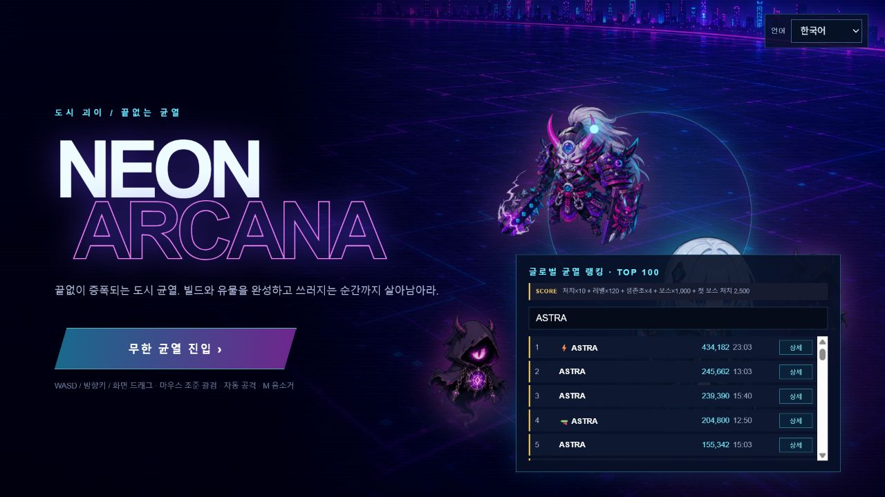
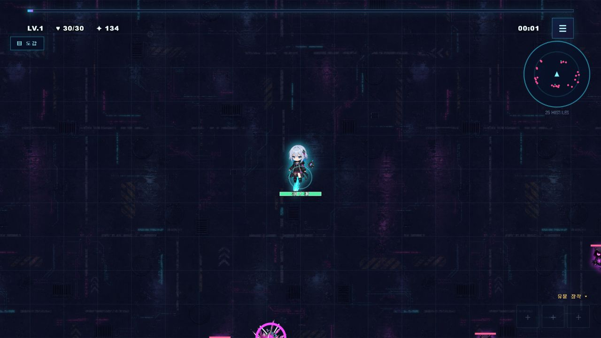
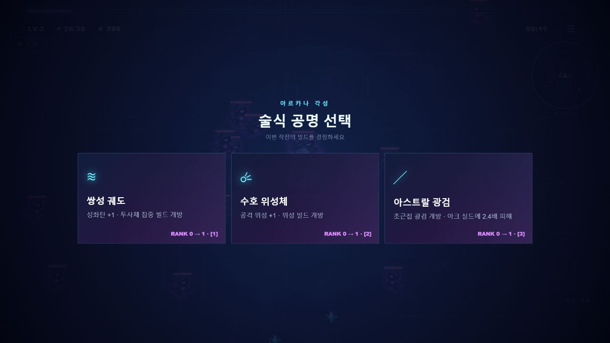
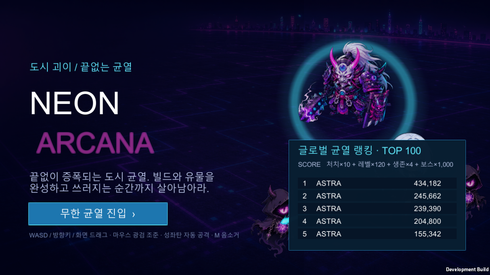
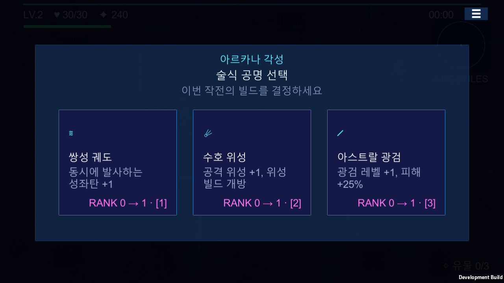

# Unity 마이그레이션 3단계 — 원작 유사도 복구 기록

> 기준일: 2026-07-27
>
> Unity: `6000.5.1f1`
>
> 프로젝트: [`unity/NeonArcanaUnity`](../unity/NeonArcanaUnity)
>
> 라이브 기준판: <https://neon-arcana-survivors.pcw0611.workers.dev/>
>
> 이전 단계: [`UNITY_MIGRATION_PHASE2.md`](UNITY_MIGRATION_PHASE2.md)
>
> 원인 회고: [`UNITY_MIGRATION_FIDELITY_RETROSPECTIVE_2026-07-27.md`](UNITY_MIGRATION_FIDELITY_RETROSPECTIVE_2026-07-27.md)
>
> 재감사·현재 작업 범위: [`UNITY_MIGRATION_INGAME_PARITY_AUDIT_2026-07-27.md`](UNITY_MIGRATION_INGAME_PARITY_AUDIT_2026-07-27.md)

> [!WARNING]
> **2026-07-27 사용자 검수 후 3단계 완료 판정을 철회했다.**
> 도감이 원작의 3개 탭과 전체 카드가 아닌 요약 텍스트로 구현됐고,
> 배경이 플레이어를 따라가도록 작성되어 월드 스크롤이 보이지 않는 문제가 확인됐다.
> 이 문서 아래의 “완료” 표기는 당시 통과한 제한된 기술 항목의 기록일 뿐,
> 현재 마이그레이션 완료 상태를 뜻하지 않는다.
> 현재 상태와 재작업 게이트는 위 재감사 문서를 기준으로 한다.

## 1. 결과 요약

3단계는 콘텐츠를 더 추가하는 단계가 아니라, 1·2단계에서 벗어난 원작의 조작·화면·프로젝트 구조를 복구하는 단계다.

이번 단계에서 다음 항목을 구현했다.

- 라이브 웹판을 직접 플레이하고 타이틀·전투·레벨업 화면을 기준 이미지로 고정
- 성좌탄을 가장 가까운 적을 향하는 완전 자동 공격으로 복구
- 마우스 조준과 이동 방향은 광검 방향에만 사용
- 승인되지 않은 오른쪽 공격 패드 제거
- 모바일 입력을 원작처럼 단일 이동 패드로 정리
- 웹판과 같은 타이틀 화면, 캐릭터 스테이지, 랭킹 패널 구성
- 사이버 도시 전투 배경과 전체 화면 HUD 재배치
- 미니맵과 적 수 표시 추가
- 웹판과 같은 레벨 2 최초 강화 3종 제시
- 강화 선택 화면을 3장 카드 레이아웃으로 복구
- 플레이어·적·투사체·HUD 등 핵심 런타임 오브젝트 9종을 실제 프리팹으로 전환
- DOTween을 도입해 화면·카드 진입과 타이틀 펄스 모션 적용
- 광검을 조준 방향의 부채꼴 판정과 아크 이펙트로 교정
- 플레이어 체력 바, 오라, 투사체·경험치·전투 펄스 비주얼 보강
- 원본/Unity 화면 자동 캡처와 회귀 검증 추가

> **기존 승인 상태 기록 — 현재 무효**
>
> 당시에는 구현 기준으로 3단계 범위를 완료했다고 판단했다.
> 그러나 확인 범위가 타이틀·전투 시작 직후·첫 강화에 치우쳐 있었고,
> 장거리 이동과 도감 전체 흐름을 검증하지 않았다.
> 따라서 `fidelityContract=80` 표식과 자동 검사 결과는 완료 근거로 사용하지 않는다.

## 2. 기준판 고정

### 2.1 확인한 원본

다음 세 가지를 함께 확인했다.

1. 라이브 웹판의 실제 플레이 흐름
2. `public/game.html`의 화면 구조와 CSS
3. `public/game-v4.js`의 입력·공격·선택 규칙

특히 `game-v4.js`의 `fire()`는 발사할 때마다 `findTarget()`을 사용한다.
마우스는 플레이어가 바라보는 방향과 광검 방향을 바꾸지만 성좌탄의 표적을 덮어쓰지 않는다.
터치도 하나의 드래그 이동 입력이며 공격용 오른쪽 패드가 없다.

### 2.2 기준 캡처

#### 타이틀



#### 전투



#### 강화 선택



이 세 이미지는 이후 화면 회귀 검토의 기준이다.

## 3. Unity 결과 화면

### 3.1 타이틀



복구한 요소:

- `NEON ARCANA` 타이틀
- 원본 `title-bg-v2.png` 배경
- 보스, 플레이어, 그림자 적, 궤도 링, 광검으로 구성한 오른쪽 스테이지
- `무한 균열 진입` 버튼
- 조작 안내
- 글로벌 랭킹 형식의 패널과 5개 행
- 청록·보라·남색 중심의 원작 색 체계

현재 랭킹 값은 로컬 정적 표시와 저장된 최고 점수를 사용한다.
Cloudflare D1 온라인 랭킹 연동은 순연된 4단계 범위다.

### 3.2 전투


자동 캡처 시점은 런 시작 후 약 1.67초다.
캡처 로그에서 웹 기준 화면과 같은 `hostiles=26`을 확인했다.

복구한 요소:

- 사이버 도시 전면 배경
- 화면 중앙 플레이어
- 가장자리에서 접근하는 그림자 적 군집
- 화면 상단 경험치 바
- 레벨, 체력, 점수, 시간
- 오른쪽 상단 메뉴와 원형 미니맵
- 미니맵 적 점과 플레이어 방향 표식
- 오른쪽 하단 유물 슬롯 표시
- 모바일에서만 나타나는 단일 이동 패드

### 3.3 레벨업 강화 선택



웹판의 레벨 2 첫 선택 규칙을 그대로 적용했다.

1. 쌍성 궤도
2. 수호 위성
3. 아스트랄 광검

카드에는 아이콘, 명칭, 효과, 현재/다음 랭크, 숫자 단축키를 표시한다.
선택 화면은 `Time.timeScale = 0`으로 전투를 멈추고 DOTween은 비스케일 시간으로 재생한다.

## 4. 행동 보존 계약

| 항목 | 웹판 규칙 | 3단계 Unity 규칙 | 상태 |
|---|---|---|---|
| 이동 | WASD·방향키·화면 드래그 | 동일 | 완료 |
| 성좌탄 | 가장 가까운 적 자동 표적 | `EnemyController.Nearest()` 자동 표적 | 완료 |
| 마우스 | 바라보기·광검 조준 | 광검 부채꼴 방향에만 반영 | 완료 |
| 터치 | 이동 드래그 하나 | 왼쪽 이동 패드 하나 | 완료 |
| 오른쪽 공격 패드 | 없음 | 제거, 프리팹·런타임 검사 | 완료 |
| 레벨 2 첫 선택 | 성좌탄·위성·광검 | 같은 순서의 3장 | 완료 |
| 레벨업 | 3장 선택 중 일시 정지 | 3장 선택 중 일시 정지 | 완료 |
| 타이틀 | 배경·스테이지·랭킹·시작 | 같은 정보 구조 | 완료 |
| HUD | XP·체력·점수·시간·미니맵 | 같은 정보 구조 | 완료 |
| 온라인 랭킹 | Cloudflare D1 | 로컬 표시만 구현 | 4단계 |
| 언어 선택 | 4개 언어 | 한국어만 구현 | 4단계 |

### 4.1 성좌탄

`PlayerController.AimAndFire()`는 공격 주기가 끝날 때 다음 순서로 동작한다.

1. 활성 적이 있는지 검사
2. 플레이어에서 가장 가까운 적 조회
3. 해당 적까지의 방향을 정규화
4. 다중 발사 수와 산포 계산
5. 성좌탄 발사

마우스 위치와 모바일 입력은 이 방향 계산에 참여하지 않는다.
코드 계약은 `PlayerController.ConstellationTargetingMode = "NearestEnemyAutomatic"`으로 명시했다.

### 4.2 광검

광검은 원작처럼 방향성 공격이다.

- 마우스가 움직였으면 마우스 월드 방향 사용
- 마우스 조준이 없으면 최근 이동 방향 사용
- `SaberArc` 각도 안의 적만 피해
- `월광 검로` 강화 시 사거리와 각도 함께 증가
- 공격 시 같은 각도의 청록색 아크 이펙트 표시

이 변경으로 “마우스는 광검 조준, 성좌탄은 자동 공격”이라는 경계를 복구했다.

## 5. 프리팹 전환

다음 9개 실제 `.prefab` 파일을 생성했다.

```text
Assets/Resources/Prefabs/
├─ Player.prefab
├─ Enemy.prefab
├─ Projectile.prefab
├─ EnemyProjectile.prefab
├─ ExperienceGem.prefab
├─ CombatPulse.prefab
├─ MovePad.prefab
├─ WorldBackground.prefab
└─ GameHud.prefab
```

### 5.1 목적

- Inspector에서 계층과 직렬화 값을 확인 가능
- 플레이어·적·UI를 코드 전체 재작성 없이 수정 가능
- 프리팹 단위로 Missing Script 검사 가능
- 모바일 UI 구조를 화면 계층으로 검토 가능
- 런타임 풀링 대상의 기본 구성을 한곳에 고정

### 5.2 생성과 재생성

에디터 메뉴:

```text
Neon Arcana > Phase 3 > Rebuild Authored Prefabs
```

배치 명령:

```powershell
Unity.exe -batchmode -nographics -quit `
  -projectPath "<repo>\unity\NeonArcanaUnity" `
  -executeMethod NeonArcana.Editor.NeonProjectSetup.Configure
```

`PhaseThreePrefabBuilder`가 9개 프리팹을 저장한 뒤 다음을 검사한다.

- 필수 프리팹 9개 존재
- `GameHud` 컴포넌트 존재
- 모든 프리팹에 Missing MonoBehaviour가 없음
- `Aim Stick`이라는 오브젝트가 계층 어디에도 없음
- `VirtualJoystick`가 정확히 1개
- 타이틀 화면 존재

### 5.3 프리팹과 런타임 생성의 관계

각 `Create()` 함수는 먼저 `Resources/Prefabs`를 로드한다.
프리팹이 누락된 개발 환경에서만 `CreateTemplate()`로 폴백한다.

따라서 정상 빌드는 프리팹 기반이며, 템플릿 코드는 자동 복구와 프리팹 재생성에만 사용한다.

## 6. DOTween 도입

사용자의 제안에 따라 공식 DOTween Free 배포본 `1.3.030`을 도입했다.

설치 위치:

```text
Assets/Plugins/Demigiant/DOTween/
```

현재 사용 범위:

- 타이틀·모달의 알파 페이드 인
- 타이틀·모달의 짧은 스케일 인
- 강화 카드의 진입 모션
- 시작 버튼과 타이틀 스테이지의 미세한 반복 펄스
- 선택 화면처럼 `Time.timeScale = 0`인 상황에서도 동작하는 비스케일 UI 모션

의도적으로 DOTween을 게임 규칙이나 자동 공격 판정에는 사용하지 않았다.
모션 라이브러리 업데이트가 전투 결과를 바꾸지 않도록 표현 계층에만 한정했다.

출처와 라이선스는 [`THIRD_PARTY_NOTICES.md`](THIRD_PARTY_NOTICES.md)에 기록했다.

## 7. 시각 구현

### 7.1 원본 에셋 재사용

웹판의 다음 리소스를 Unity `Resources/Art`에서 사용한다.

- `title-bg-v2.png`
- `cyber-city.png`
- `astra-sd.png`
- `shade-sd.png`
- `bosses.png`
- `saber-blade.png`
- 기존 2단계의 보스·클래스·VFX 리소스

### 7.2 Unity 절차 생성 리소스

`NeonAssets`는 다음 스프라이트를 런타임에 생성하고 캐시한다.

- 원형 글로우
- 네온 링
- 성좌탄 볼트
- 경험치 다이아몬드
- 방향성 광검 아크

이 리소스는 흰 사각형 임시 그래픽을 대체한다.

### 7.3 미니맵

`MiniMapGraphic`은 UGUI `Graphic`을 상속한 전용 메시 렌더러다.

- 바깥 원
- 내부 원
- 중앙의 플레이어 삼각형
- 플레이어 주변 적 위치를 정규화한 분홍 점
- 한 프레임에 최대 96개 점

월드 적 위치는 `EnemyController.FillMinimap()`에서 읽는다.

## 8. 주요 변경 파일

```text
Assets/NeonArcana/
├─ Combat/
│  ├─ CombatPulse.cs
│  └─ Projectile.cs
├─ Core/
│  ├─ GameManager.cs
│  ├─ NeonAssets.cs
│  ├─ NeonGameBootstrap.cs
│  └─ PhaseThreeCaptureDriver.cs
├─ Editor/
│  ├─ NeonProjectSetup.cs
│  └─ PhaseThreePrefabBuilder.cs
├─ Enemies/
│  ├─ EnemyController.cs
│  └─ EnemyProjectile.cs
├─ Input/
│  └─ VirtualJoystick.cs
├─ Player/
│  └─ PlayerController.cs
├─ Progression/
│  └─ ExperienceGem.cs
└─ UI/
   ├─ GameHud.cs
   ├─ MiniMapGraphic.cs
   ├─ NeonPulse.cs
   └─ UiMotion.cs
```

## 9. 검증

### 9.1 정적·시뮬레이션 검증

실행 메서드:

```text
NeonArcana.Editor.NeonProjectSetup.ValidatePhaseThreeBatch
```

결과:

```text
NEON_ARCANA_VALIDATION_OK
NEON_ARCANA_PHASE2_SIMULATION_OK bosses=13 enemyPeak=190
NEON_ARCANA_PHASE3_VALIDATION_OK fidelityContract=80 prefabs=9 projectileTargeting=automatic rightAimPad=removed
```

### 9.2 Play Mode 스모크

실행 메서드:

```text
NeonArcana.Editor.NeonProjectSetup.PlaySmokeBatch
```

결과:

```text
NEON_ARCANA_PHASE2_PLAY_SMOKE_OK enemies=148 kills=10 class=Thor relics=1 boss=Dragon elapsed=623.63
NEON_ARCANA_PHASE3_PLAY_SMOKE_OK prefabs=9 touchPads=1 targeting=NearestEnemyAutomatic
```

검사 범위:

- 런타임 부트스트랩
- 자동 성좌탄으로 실제 적 처치
- 적 스폰
- 보스 생성
- 전직, 유물, 광검, 위성
- HUD 생성
- 이동 패드 정확히 1개
- 자동 표적 방향 생성

Unity 에디터 검색 인덱서가 시작 시 남기는 `ArgumentOutOfRangeException`은
`UnityEditor.Search.SearchDatabase` 내부 스택이며 게임 런타임 예외가 아니다.
플레이어 로그에는 Missing Script, `NullReferenceException`, 처리되지 않은 게임 예외가 없었다.

### 9.3 Windows 빌드

결과:

```text
NEON_ARCANA_WINDOWS_BUILD_OK size=166302280
```

로컬 출력:

```text
unity/NeonArcanaUnity/Builds/Windows/NeonArcanaPrototype.exe
```

`Builds`는 저장소에서 제외되므로 GitHub에는 실행 파일 대신 재현 가능한 프로젝트와 빌드 메서드를 배포한다.

### 9.4 자동 화면 캡처

Windows 플레이어에 다음 인자를 줄 수 있다.

```text
--capture-phase3-title=<png>
--capture-phase3-gameplay=<png>
--capture-phase3-world=<png>
--capture-phase3-upgrade=<png>
```

캡처 드라이버는 준비 프레임 이후 비스케일 시간으로 기다린 다음 PNG를 저장하고 종료한다.
마지막 전투 캡처 표식:

```text
NEON_ARCANA_PHASE3_CAPTURE_OK mode=Gameplay elapsed=1.67 hostiles=26
```

## 10. 구현 중 발견한 회귀 위험

### 10.1 파일명과 다른 MonoBehaviour

처음 프리팹을 만든 뒤 `CombatPulse`와 `NeonPulse`가 Missing Script로 직렬화되는 문제가 있었다.

원인:

- `CombatPulse`가 `Projectile.cs` 안에 있었음
- `NeonPulse`가 `UiMotion.cs` 안에 있었음
- Unity 프리팹은 파일명과 일치하지 않는 보조 `MonoBehaviour`를 안정적으로 스크립트 에셋에 연결하지 못함

조치:

- `CombatPulse.cs`로 분리
- `NeonPulse.cs`로 분리
- 모든 프리팹의 Missing MonoBehaviour 개수를 자동 검사
- Windows 플레이어 로그에서도 Missing Script 문구 검사

### 10.2 런타임 생성 Sprite의 프리팹 저장

절차 생성 Sprite는 에디터 메모리 오브젝트이므로 프리팹에 영구 에셋 참조로 저장되지 않는다.

조치:

- 플레이어·적·투사체는 `ResolveVisuals()`에서 필요한 Sprite를 다시 연결
- 타이틀 스테이지는 `GameHud.Bind()`에서 다시 연결
- 월드 배경은 `NeonGameBootstrap.CreateBackground()`에서 다시 연결

이 규칙을 지키지 않으면 빌드에서 흰 사각형이나 검은 배경이 나타난다.

## 11. 현재 차이와 후순위 이관

다음 항목은 기존 문서 작성 당시 3단계에서 완성했다고 주장하지 않았던 목록이다.

- Cloudflare D1 온라인 랭킹
- 한국어 외 언어 선택
- 사이버 리바이어던과 내부 던전
- 길들인 보스 동료
- 웹판 전체 오디오와 음소거
- 모든 전직 궁극기의 원작 수준 전용 VFX
- 전용 셰이더, 파티클, 카메라 흔들림 최종 폴리싱
- 실제 Android 기기의 성능·발열·멀티터치 검증
- AAB 서명과 스토어 배포

이후 사용자 지시에 따라 범위를 다시 나눴다.

- 리바이어던·내부 던전·길들인 보스·오디오·VFX처럼 플레이 중 체감하는 항목은 인게임 재작업에 포함한다.
- 서버 연결, 온라인 랭킹, 웹/실행 파일 배포, AAB 서명, 스토어 등록은 인게임 승인 뒤로 미룬다.
- 최신 범위는 재감사 문서를 기준으로 한다.

## 12. 정정된 다음 작업

세 장의 정지 화면 검토만으로 다음 단계로 넘어가지 않는다.
먼저 인게임 전수 대조표의 P0·P1 항목을 재작업하고 전체 플레이 흐름을 검증한다.
서버·배포·서명·스토어 작업은 이 과정이 승인된 뒤에만 다시 계획한다.

원작과 다른 개선안을 넣을 경우에는 원작 동작을 기본값으로 유지하고,
변경 이유·장단점·옵션화 여부를 먼저 사용자에게 승인받는다.

## 13. 사용자 검수 후 P0 재작업 기록

### 13.1 무한 월드 스크롤 복구

사용자 검수에서 “맵 스크롤이 되지 않는다”는 문제가 확인됐다.
기존 `CameraFollow`는 카메라뿐 아니라 `Cyber City Background`도 매 프레임 플레이어 위치로 옮겼다.
플레이어와 배경의 상대 위치가 고정되므로 월드 좌표는 변해도 화면에서 배경 이동을 느낄 수 없었다.

다음과 같이 교체했다.

- 기존 `CameraFollow` 제거
- `CinemachineBrain`, `CinemachineCamera`, `CinemachinePositionComposer` 기반 2D 추적 카메라
- 좌우·상하 추적 감쇠 `0.12`
- `InfiniteWorldBackground` 컴포넌트
- 5×5 사이버 도시 반복 타일
- 웹판과 같은 0.72 Unity 단위 월드 그리드
- 타일 경계를 넘을 때 보이는 빈 공간 없이 앵커 재배치
- 카메라를 따라가는 안개는 배경 패턴과 분리

`WorldBackground.prefab`은 `InfiniteWorldBackground`를 직렬화한다.
타일과 그리드는 무한 월드의 현재 카메라 셀 주변만 런타임에 재사용한다.

### 13.2 이동 후 결과 화면

아래 캡처는 런 시작 후 플레이어를 월드 좌표 `(18, 9)`로 이동한 상태다.


### 13.3 검증

정적 검증:

```text
NEON_ARCANA_PHASE3_VALIDATION_OK ... infiniteWorld=authored
```

Play Mode 스모크:

```text
NEON_ARCANA_PHASE3_PLAY_SMOKE_OK ... worldTiles=25 tileAnchor=(20.48, 10.24) gridAnchor=(17.28, 8.64)
```

스모크 테스트는 플레이어를 실제로 `(18, 9)`로 이동한 뒤 다음을 검사한다.

- Cinemachine 카메라와 플레이어 사이 거리 0.5 이하
- 도시 타일 25개 활성
- 타일 앵커가 원점에서 이동
- 월드 그리드 앵커가 원점에서 이동
- `WorldBackground.prefab`에 무한 월드 컴포넌트 존재

Windows 개발 빌드도 다시 통과했다.

```text
NEON_ARCANA_WINDOWS_BUILD_OK size=167254479
```

이 항목은 기술 검증을 통과했지만 3단계 전체 완료를 뜻하지 않는다.
도감과 나머지 P0·P1 항목의 재작업은 계속한다.

## 14. P0 도감·작전 메뉴 재작업

월드 스크롤 다음으로 웹판 도감과 작전 메뉴를 일대일 대조해 다시 구현했다.

- `CodexView`: 술식·유물·전직 3탭과 세로 스크롤
- `CodexCard.prefab`: 아이콘·이름·상태·설명·희귀도/마스터 외곽선
- 술식 27개, 유물 21개, 전직 5개 런타임 카드
- 현재 랭크, 보유 유물 레벨, 발견 기록, 활성 전직 상태
- 왼쪽 상단 `▤ 도감`, 오른쪽 상단 `☰` 작전 메뉴 분리
- 계속하기, 사운드, 히트박스, 작전 포기
- `Escape` 메뉴 열기/닫기, `M` 음소거
- 메뉴와 도감의 일시 정지·재개 상태 분리
- DOTween 모션 완료 안전장치


상세 구현, 검증 값, 남은 P0 목록은
[`UNITY_MIGRATION_P0_PROGRESS_2026-07-27.md`](UNITY_MIGRATION_P0_PROGRESS_2026-07-27.md)에 기록했다.

Play Mode 스모크 결과:

```text
NEON_ARCANA_PHASE3_PLAY_SMOKE_OK ... codexTabs=27/21/5 gameMenu=pauseResume
```

필수 프리팹은 `CodexCard.prefab` 추가로 10개가 됐다.
도감과 메뉴 역시 기술 검증 통과 상태이며 사용자 체감 승인 전에는 3단계 완료로 표시하지 않는다.
